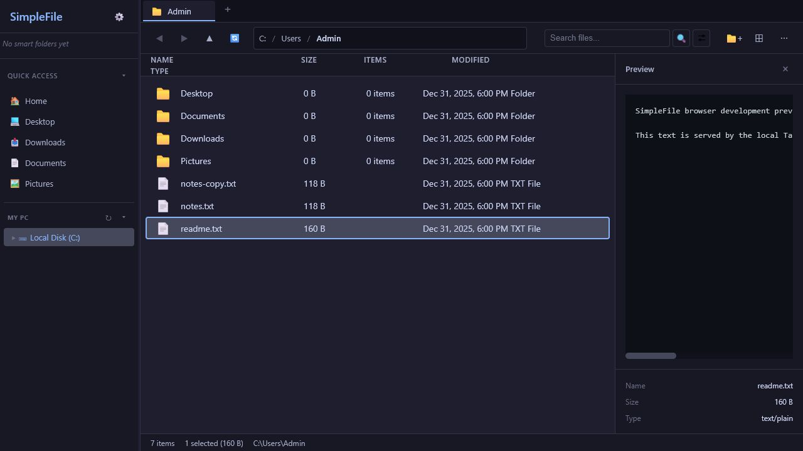
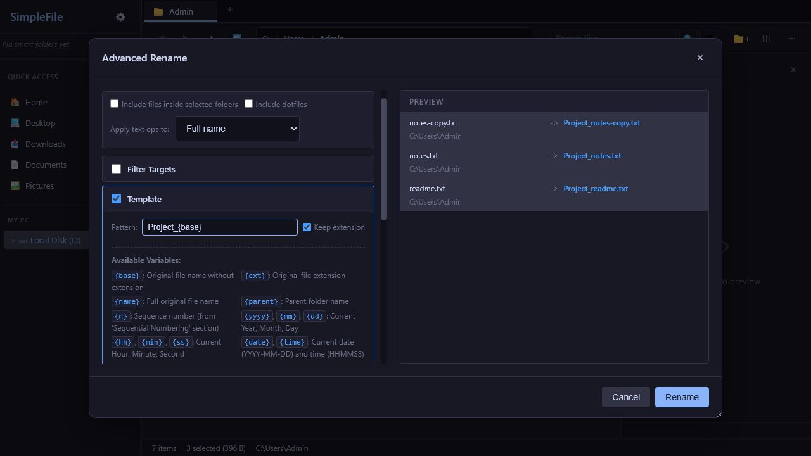

# SumaFile

[](https://github.com/conniecombs/SumaFile/actions/workflows/ci.yml)
[](https://github.com/conniecombs/SumaFile/actions/workflows/release.yml)
[](https://github.com/conniecombs/SumaFile/actions/workflows/installer-smoke.yml)


**SumaFile** is a modern, high-performance file manager for **Windows 10+ (x64)**.
It is built with [WinUI 3](https://learn.microsoft.com/windows/apps/winui/winui3/) and a Rust named-pipe IPC service.

If Windows File Explorer feels limited for power workflows — dual panes, tabs per pane, batch rename, archives, search, previews, checksums, Git status, cleanup tools — SumaFile puts those tools in one native desktop app.

<p align="center">
  
</p>

---

## Table of Contents

- [Why SumaFile](#why-sumafile)
- [Screenshots](#screenshots)
- [Features](#features)
- [Installation](#installation)
- [Getting Started](#getting-started)
- [Keyboard Shortcuts](#keyboard-shortcuts)
- [Settings](#settings)
- [Development](#development)
- [Project Structure](#project-structure)
- [Architecture](#architecture)
- [Verification & Testing](#verification--testing)
- [Release & Packaging](#release--packaging)
- [Documentation](#documentation)
- [Security](#security)
- [Scope of This Branch](#scope-of-this-branch)
- [Support](#support)
- [License](#license)

---

## Why SumaFile

| Goal | What you get |
| --- | --- |
| Work faster on two folders | Dual-pane mode with independent tabs, history, and selection per pane |
| Stay in one window | Tabbed browsing, breadcrumbs, tree view, Quick Access, bookmarks, recents |
| Move files safely | Progress with bytes/rate/ETA, cancel, conflict options, undo/redo |
| Inspect before you open | Preview pane + spacebar Quick Look for images, media, code, PDF, Markdown |
| Clean and organize | Advanced rename, tags/labels, smart folders, duplicates, disk cleanup |
| Stay Windows-native | Drive list, mapped network shares, Recycle Bin, Open With, terminal launch |
| Ship with confidence | NSIS + MSI installers, in-app update check, CI and installer smoke tests |

**Current release:** `BETA` (see [docs/CHANGELOG.md](docs/CHANGELOG.md); historical notes for the last numbered release: [docs/RELEASE_1.1.0.md](docs/RELEASE_1.1.0.md)).

---

## Screenshots

| Main Window | Advanced Rename |
| :---: | :---: |
|  |  |

| File Comparison | File List Settings |
| :---: | :---: |
|  |  |

---

## Features

### Navigation & browsing

- **Dual-pane mode** — two independent browsers side by side (`F6`)
- **Per-pane tabs** — each pane keeps its own tab set, active tab, and navigation state
- **Breadcrumb bar** — jump to any parent segment of the current path
- **Tree view sidebar** — hierarchical folder navigation with optional auto-collapse
- **Editable path bar** — click to type a path; matching folders are suggested as you type
- **Quick Access & bookmarks** — pin folders you use constantly
- **Recent locations** — return to places you visited recently
- **Back / forward history** — per-pane history via `Alt+Left` / `Alt+Right`
- **Type-ahead selection** — start typing a name to jump to matching items
- **Marquee (rubber-band) selection** — drag to multi-select in list or grid
- **Huge-folder virtualization** — list/grid stay responsive in very large directories
- **Live folder watching** — directory contents refresh when the filesystem changes

### File operations

- **Copy, cut, paste, move** with transfer manager operation IDs
- **Real-time progress** — bytes completed/total, rate, ETA, and cancelling state
- **Delete to Recycle Bin** or permanent delete (`Delete` / `Shift+Delete`)
- **Conflict handling** — skip, replace, keep both, or refuse overwrite when needed
- **Create file / folder** — `Ctrl+N` / `Ctrl+Shift+N`
- **Rename** single items (`F2`) and **Advanced Rename** for batch patterns
- **Drag and drop** between panes, tabs, and external applications
- **Undo / redo** for create, rename, copy, and move (`Ctrl+Z` / `Ctrl+Y`)
- **Clipboard history** — re-use recent copy/cut sets (`Ctrl+Shift+V`)
- **Copy full path** to the system clipboard (`Ctrl+Shift+C`)
- **Cross-pane transfer** — copy or move selection to the other pane (`Ctrl+Alt+C` / `Ctrl+Alt+M`)

### Advanced rename

- Batch rename with live preview
- Template tokens, regex remove/replace, whitespace cleanup, separator conversion
- Extension transforms and name sanitization
- Optional recursive targeting into selected folders
- Warnings for duplicates and invalid names before you commit

### Windows drives & network

- **Recycle Bin** — browse deleted items, restore them, or empty the bin
- Native drive list with volume labels, drive types, and free-space indicators
- Mapped network share names with offline / stale status detection
- Drive refresh and reconnect flow when a share is unavailable
- Status bar drive-space meter for the active location

### Search & smart folders

- **Quick filter** — instant filename filter in the current directory
- **Recursive search** through subfolders
- **Content search** inside file contents (toggle on the search box)
- Filters for size, date, depth, and hidden files
- Cancellable, batched results so large trees stay usable
- **Smart folders** — save search criteria as reusable virtual folders

### Archives

- List, create, and extract **ZIP**, **TAR**, **TAR.GZ / TGZ**, and **RAR**
- Extraction path validation so unpack stays inside the chosen destination
- Optional RAR tooling install from **Settings → Tools**

### Preview, inspection & comparison

**Preview pane / Quick Look (`Space`) support includes:**

| Kind | Formats / notes |
| --- | --- |
| Images | PNG, JPG, GIF, SVG, WebP, BMP, ICO, TIFF (+ EXIF where available) |
| Video | MP4, WebM, AVI, MOV, MKV, FLV, WMV, OGG |
| Audio | MP3, WAV, FLAC, OGG, AAC, WMA, M4A, AIFF |
| Code & text | Plain-text and common source-file previews |
| Documents | PDF metadata/preview and Markdown text preview |
| Fonts | TTF, OTF, WOFF, WOFF2 |

**Also available:**

- Properties panel — size, type, timestamps, attributes
- Folder size and recursive item counts (optional, cached for responsiveness)
- Metadata for PDF, audio, video, and Office package props
- Checksums — **MD5**, **SHA-1**, **SHA-256**
- **Compare Files** — side-by-side text diff for UTF-8 files and hex diff for binary files

### Organization & views

- Color **labels / tags** on files and folders
- Configurable list columns (Size, Items, Modified, Type) with Explorer-style resize handles
- List and grid views with adjustable default icon size
- Dark and light themes
- Show/hide Windows hidden and system files (`Ctrl+H`)
- Optional folder size calculation and Git status in the list
- Workspace layout persistence (panes, tabs, view mode, and related UI state)

### Developer-friendly tools

- **Git integration** — branch name, status counts, per-file indicators; pull/push from the app
- **Open in terminal** — PowerShell, Command Prompt, Git Bash, or Windows Terminal (`F4`)
- Elevated PowerShell launch when you need admin shell access
- **Open With** for choosing an application per file
- **Command palette** (`Ctrl+Shift+P`) for quick actions

### Cleanup & maintenance

- **Duplicate file finder** with progress and cancellation
- **Disk cleanup** helpers for large/old clutter workflows
- In-app **update check** and signed installer flow against `latest-winui.json`, with GitHub Releases fallback when metadata is unsigned

### Productivity surfaces

- Context menus for files, folders, and column headers
- Keyboard help overlay (`F1` or `Ctrl+?`)
- Toasts for operation feedback
- About dialog with live app version metadata

---

## Installation

### End users

Download the latest Windows installer or portable package from **[GitHub Releases](https://github.com/conniecombs/SumaFile/releases)**.

| Artifact | Best for |
| --- | --- |
| `SumaFile_BETA_x64-winui-setup.exe` | **Recommended** — NSIS per-user install |
| `SumaFile_BETA_x64-winui.msi` | Enterprise / GPO-style MSI deployment |
| `SumaFile_BETA_x64-winui-portable.zip` | Portable use without running an installer |

**Requirements:** Windows 10 or later, x64.

After the first manual install, **Settings → Updates** can check for a newer version. Signed releases can be downloaded, verified, and launched in-app; unsigned or incomplete update metadata falls back to GitHub Releases.

### What the release ships

- Windows x64 WinUI NSIS setup executable
- Windows x64 WinUI MSI package
- Windows x64 portable zip (`SumaFile.exe` + `simplefile-service.exe`)
- Updater metadata `latest-winui.json` (production releases)

---

## Getting Started

1. Install SumaFile and open it.
2. Browse with the **sidebar** (drives, Quick Access, bookmarks, recents, smart folders) or the **tree**.
3. Press **`F6`** for dual-pane when you need source and destination side by side.
4. Use **`Ctrl+T`** for a new tab on the active pane; each pane keeps its own tabs.
5. Press **`Space`** for Quick Look, or open the preview pane for persistent inspection.
6. Open **Settings** to set theme, start location, columns, shortcuts, Git, RAR tools, and updates.

### Suggested first customizations

| Preference | Where |
| --- | --- |
| Theme & default list/grid | Settings → Appearance |
| Visible columns, hidden files, folder sizes, Git | Settings → File List |
| Home / last used / custom start path | Settings → Navigation |
| Confirm delete & Recycle Bin default | Settings → Behavior |
| Remap shortcuts | Settings → Shortcuts |
| Git & RAR tooling | Settings → Tools |
| Check for app updates | Settings → Updates |

---

## Keyboard Shortcuts

Press **`F1`** (or **`Ctrl+?`**) inside the app, or open **Settings → Shortcuts**, for the live shortcut list.

### Navigation

| Shortcut | Action |
| --- | --- |
| `Ctrl+L` / `Alt+D` | Focus path bar (folder suggestions while typing) |
| `Enter` (in path bar) | Go to entered path |
| `Alt+Up` / `Backspace` | Parent folder |
| `Alt+Left` / `Alt+Right` | Back / forward |
| `F5` | Refresh active pane |
| Arrow keys | Move selection |
| `Shift` + arrows / `Home` / `End` | Extend selection |
| `Home` / `End` | First / last item |
| Type-ahead | Jump to matching name (no modifiers) |

### File operations

| Shortcut | Action |
| --- | --- |
| `Enter` | Open selected item |
| `Ctrl+Enter` | Open folder in new tab |
| `Alt+Enter` | Properties |
| `F2` | Rename |
| `Delete` | Move to Recycle Bin |
| `Shift+Delete` | Permanent delete |
| `Ctrl+C` / `Ctrl+X` / `Ctrl+V` | Copy / Cut / Paste |
| `Ctrl+Shift+C` | Copy full path(s) |
| `Ctrl+Shift+V` | Clipboard history |
| `Ctrl+A` | Select all |
| `Ctrl+N` | New file |
| `Ctrl+Shift+N` | New folder |
| `Ctrl+Z` | Undo |
| `Ctrl+Y` / `Ctrl+Shift+Z` | Redo |

### Tabs & dual pane

| Shortcut | Action |
| --- | --- |
| `Ctrl+T` | New tab (active pane) |
| `Ctrl+W` | Close active tab |
| `Ctrl+Tab` / `Ctrl+Shift+Tab` | Next / previous tab |
| `Ctrl+1`–`Ctrl+9` | Switch to tab (9 is last) |
| `F6` | Toggle dual pane |
| `Tab` | Switch active pane (when dual pane is on) |
| `Alt+1` / `Alt+2` | Focus left / right pane |
| `Ctrl+Shift+Left` / `Right` | Focus left / right pane |
| `Ctrl+Alt+C` / `Ctrl+Alt+M` | Copy / move selection to other pane |

### View & tools

| Shortcut | Action |
| --- | --- |
| `Space` | Quick Look |
| `Ctrl+H` | Show or hide hidden files |
| `Ctrl+B` | Bookmark current folder |
| `Ctrl+Mouse wheel` | Change icon size |
| `Ctrl+F` / `F3` | Focus search |
| `Ctrl+Shift+P` | Command palette |
| `F4` | Open terminal here |
| `F1` / `Ctrl+?` | Keyboard shortcuts help |
| `Escape` | Close surface, clear filter, or clear selection |

---

## Settings

Settings are organized into searchable sections:

| Section | What it controls |
| --- | --- |
| **Appearance** | Dark/light theme, default list or grid, icon size, columns, hidden files |
| **Navigation** | Start location (Home / Last used / Custom path), open folders in new tab, side menu sections |
| **Behavior** | Confirm before delete, keep folders on top, folder sizes, Git |
| **Shortcuts** | View the keyboard shortcut list (remapping is not available yet) |
| **Tools** | Git tooling status, optional RAR install helpers |
| **Updates** | Current version, check/install updates |
| **About** | App info and project links |

Workspace layout (dual pane, active pane, tabs per pane, view mode, and related chrome) is restored across sessions where possible.

---

## Development

### Prerequisites

| Tool | Version | Purpose |
| --- | --- | --- |
| [Node.js](https://nodejs.org/) | **24+** | Repo check scripts |
| [Rust](https://rustup.rs/) | Stable | `simplefile-service` and core crates |
| [.NET SDK](https://dotnet.microsoft.com/download) | **8+** | WinUI 3 host |
| Windows SDK | — | WinUI / Windows App SDK targeting |
| [NSIS](https://nsis.sourceforge.io/) | Optional | Local setup.exe |
| [WiX Toolset](https://wixtoolset.org/) | Optional | Local MSI |

### Quick start

```powershell
# 1. Clone
git clone https://github.com/conniecombs/SumaFile.git
cd SumaFile

# 2. Development app (Rust IPC service + WinUI 3 host)
npm run dev

# 3. Quality gates used by contributors and CI
npm run check
npm run check:winui
npm run check:rust
```

See [src-winui/README.md](src-winui/README.md).

### Root scripts

Run from the **repository root** with `npm run <script>`.

| Script | Description |
| --- | --- |
| `dev` / `dev:winui` | Build `simplefile-service` and run the WinUI 3 host |
| `build` / `build:winui:release` | Publish WinUI payload, portable zip, and installers |
| `build:winui` | `dotnet build src-winui/SimpleFile.sln` |
| `check` | Generated IPC bindings, IPC schema, identity, updater, workflows, packaging, parity gate |
| `check:winui` | WinUI xUnit tests |
| `generate:ipc-bindings` | Regenerates schema-derived IPC constants and C# client wrappers |
| `check:ipc-generated` | Verifies generated IPC bindings are current |
| `check:ipc-schema` | 78-command schema vs Rust/C# |
| `check:identity` | Guards current-facing links and repo metadata against stale legacy repository references |
| `check:updater` | WinUI updater metadata wiring |
| `check:workflows` | GitHub workflow sanity checks |
| `check:provider-surface` | Guards out-of-scope provider/mount surfaces |
| `check:windows-assets` | Packaging assets remain Windows-correct |
| `check:winui-packaging` | NSIS / MSI / release script surface |
| `check:winui-parity-gate` | Parity gate statuses stay PASS/WAIVED |
| `check:rust` | `cargo fmt --check`, tests, Clippy (`-D warnings`) |
| `check:security` | Rust dependency audit (`cargo-audit`) |
| `check:release` | `check` + `check:rust` + `check:security` |
| `release:build` / `release:local` | Local WinUI release pipeline |
| `smoke:winui` | Built payload launch smoke |
| `smoke:winui-msi` | MSI extract/launch smoke |
| `smoke:winui-installer` | NSIS install → launch → uninstall smoke |

---

## Project Structure

```text
SumaFile/
├── src-winui/                    WinUI 3 unpackaged host
│   ├── SimpleFile.App/           Explorer window, settings, chrome
│   ├── SimpleFile.Core/          Workspace, menus, transfers, settings
│   ├── SimpleFile.Ipc/           Named-pipe JSON-RPC client
│   └── SimpleFile.Tests/         xUnit navigation / IPC / polish tests
├── crates/
│   ├── simplefile-core/          Host-independent file-manager domain
│   ├── simplefile-ipc/           Framing + JSON-RPC types
│   └── simplefile-service/       Named-pipe IPC service process
├── ipc/schema/                   Named-pipe JSON-RPC contract
├── packaging/winui/              NSIS + WiX + app icon
├── scripts/                      Repo-level checks, release, and smokes
├── docs/                         User/dev docs, changelog, screenshots
├── build_notes/                  Internal hardening / migration notes
├── .github/workflows/            CI, release, installer smoke, Dependabot
├── package.json                  Root orchestration scripts
├── base_icon.png                 Generated D3 SumaFile icon artwork
└── LICENSE                       Proprietary license
```

**Entry points**

- Shipping UI: `src-winui/SimpleFile.App`
- IPC client: `src-winui/SimpleFile.Ipc`
- Backend service: `crates/simplefile-service`
- Reusable domain: `crates/simplefile-core`

---

## Architecture

SumaFile uses a **WinUI 3 UI process** plus a **Rust IPC service**:

```text
┌──────────────────────────────────────────────────────┐
│                 WinUI 3 host                         │
│                                                      │
│  ExplorerWorkspace → ISimpleFileIpc                  │
│                      named-pipe JSON-RPC             │
└──────────────────────────────┬───────────────────────┘
                               │
                               ▼
┌──────────────────────────────────────────────────────┐
│            simplefile-service (Rust)                 │
│                                                      │
│  dispatch.rs → simplefile-core                       │
│    file_ops / progress / drives / search / archive   │
│    preview / metadata / checksum / compare / watcher │
└──────────────────────────────────────────────────────┘
```

### Design rules that matter in practice

- **Typed IPC surface** — `SimpleFile.Ipc.Protocol` and `ipc/schema/v1` stay aligned with the 78 domain commands.
- **Transfer safety** — copy/cut/paste/drag/drop/dual-pane transfers share a transfer manager with stable operation IDs, progress events, cancel, and conflict resolution.
- **Host-owned pickers** — folder browse is WinUI `FolderPicker`; the service returns `HOST_OWNED:`.
- **Windows-first filesystem APIs** — drive labels, mapped shares, trash, and process launching stay in dedicated Rust modules.
- **Job-object lifetime** — the UI starts `simplefile-service` and kills it when the window exits.

---

## Verification & Testing

### Quality gates

| Command | Covers |
| --- | --- |
| `npm run check` | Generated IPC bindings, IPC schema, identity, updater, workflows, provider surface, Windows assets, WinUI packaging, parity gate |
| `npm run check:winui` | WinUI xUnit tests for navigation, transfers, and polish |
| `npm run check:rust` | Format, unit/integration tests, Clippy with warnings denied |
| `npm run check:security` | Rust dependency audit |
| `npm run check:release` | All of the above — release-quality gate |
| `npm run release:build` | Local WinUI release build + installer smokes + artifact listing |

### Smoke tests

| Command | Validates |
| --- | --- |
| `npm run smoke:winui` | Built payload executable launches |
| `npm run smoke:winui-msi` | MSI artifact extract/launch |
| `npm run smoke:winui-installer` | Full NSIS install → launch → uninstall |
| `npm run smoke:winui-upgrade` | Previous NSIS install → new NSIS upgrade → launch → persisted app data check → uninstall |

### Architectural guards

The `check` pipeline also enforces project invariants:

- Out-of-scope provider/mount management surfaces stay excluded
- Packaging assets and bundle targets stay Windows-only
- The generated IPC bindings and 78-command schema stay aligned with C# / leftover Rust command names
- Current-facing docs, updater metadata, and app links point to the SumaFile repository
- WinUI parity-gate required rows stay `PASS` or `WAIVED`

> **Note:** Full installer packaging is intentionally slow. PR CI focuses on fast gates; run the **Installer Smoke** workflow (nightly or manual) or `npm run release:build` before cutting a release.

---

## Release & Packaging

### Bundle targets

| Format | Artifact pattern | Notes |
| --- | --- | --- |
| NSIS | `SumaFile_<version>_x64-winui-setup.exe` | Per-user install; recommended for most users |
| MSI | `SumaFile_<version>_x64-winui.msi` | Per-user style deployment |
| Portable | `SumaFile_<version>_x64-winui-portable.zip` | `SumaFile.exe` + `simplefile-service.exe` |

### Config files

| File | Role |
| --- | --- |
| `packaging/winui/simplefile-winui.nsi` | Per-user NSIS setup |
| `packaging/winui/Product.wxs` | Per-user WiX MSI |
| `packaging/winui/icon.ico` | Embedded app, installer, and shortcut icon |
| `scripts/generate-winui-icon.py` | Regenerates `base_icon.png` and `packaging/winui/icon.ico` |
| `src-winui/Directory.Build.props` | WinUI version |
| `crates/simplefile-service/Cargo.toml` | Service version |

### Auto-updater

Production builds publish updater metadata to:

`https://github.com/conniecombs/SumaFile/releases/latest/download/latest-winui.json`

**Settings → Updates** checks that manifest. In-app **Download & Install** is enabled only when the manifest includes a trusted SumaFile setup URL, installer size, SHA-256, and Ed25519 signature that matches the public key embedded at build time. Unsigned or incomplete metadata remains a safe manual download from GitHub Releases.

Operational details: [docs/UPDATER_RELEASE.md](docs/UPDATER_RELEASE.md).

### Release workflows

| Workflow | Purpose |
| --- | --- |
| [CI](.github/workflows/ci.yml) | Push/PR quality gates |
| [Release build](.github/workflows/release-build.yml) | On-demand `npm run release:build`; uploads artifacts; does **not** publish a GitHub Release |
| [Release](.github/workflows/release.yml) | Tag `v*` or manual dispatch: validate version, run `check:release`, build signed installers plus portable zip, publish draft GitHub Release |
| [Installer Smoke](.github/workflows/installer-smoke.yml) | Nightly/manual installer validation |

### Versioning

User-facing version is **BETA** (About, Settings, README badge, installer DisplayVersion, artifact names). Keep these in sync:

- `src-winui/Directory.Build.props` `<InformationalVersion>` (display) and `<Version>` (numeric packaging identity, currently `0.1.0`)
- `crates/simplefile-core/src/lib.rs` `APP_DISPLAY_VERSION` (must match InformationalVersion)
- `crates/simplefile-service/Cargo.toml` package `version` (must match `<Version>`; committed `Cargo.lock`)
- README version badge
- `docs/CHANGELOG.md` (and release notes as needed)

Checklist: [.github/RELEASE.md](.github/RELEASE.md).

---

## Documentation

| Document | Description |
| --- | --- |
| [Changelog](docs/CHANGELOG.md) | Version history |
| [v1.1.0 Release Notes](docs/RELEASE_1.1.0.md) | Historical notes for the last numbered public release |
| [Roadmap](docs/ROADMAP.md) | Near-term priorities and non-goals |
| [Contributing](docs/CONTRIBUTING.md) | How to work on this repo |
| [Code of Conduct](docs/CODE_OF_CONDUCT.md) | Community standards |
| [Support](docs/SUPPORT.md) | What to include when reporting issues |
| [Security Policy](docs/SECURITY.md) | Vulnerability reporting and sensitive-file rules |
| [Updater Release Guide](docs/UPDATER_RELEASE.md) | Publishing signed updates |
| [Release Checklist](.github/RELEASE.md) | Step-by-step release process |

Additional design/history notes live under `docs/` and `build_notes/` for maintainers.

---

## Security

- **Do not commit** signing keys, updater private keys, `.env` files, local secrets, personal settings exports, or logs with private paths.
- Archive extraction re-validates destination paths; TAR extraction skips symlink/special entries that could escape the target tree.
- Report vulnerabilities as described in [docs/SECURITY.md](docs/SECURITY.md).

Sensitive paths ignored by the repo include `.secrets/`, `*.key`, `.env`, and `.env.*`.

---

## Scope of This Branch

This repository targets a **Windows-only local file manager**.

### In scope

- Local disks, removable media, and mapped network drives
- Dual pane, per-pane tabs, search, smart folders, previews, metadata
- Archives, Git status/actions, cleanup tools
- NSIS/MSI packaging, `latest-winui.json` updater metadata, signed in-app installer verification, and upgrade smoke coverage

### Out of scope (for this branch)

- App-managed provider integrations
- Provider-backed mount management
- Linux/macOS desktop packaging targets

See [docs/ROADMAP.md](docs/ROADMAP.md) for active priorities.

---

## Support

Before opening an issue:

1. Confirm you are on a Windows release or a build from this repo’s Windows-focused `main` branch.
2. Note SumaFile version from **Settings → About** (or the About dialog).
3. Capture whether the problem is in dev, an unpacked build, NSIS, or MSI.
4. For installers, run `npm run smoke:winui-installer`, `npm run smoke:winui-upgrade`, and `npm run smoke:winui-msi` when possible.
5. Redact personal paths from logs and screenshots.

More detail: [docs/SUPPORT.md](docs/SUPPORT.md).

Startup diagnostics on Windows may be written to:

`%LOCALAPPDATA%\SumaFile\startup.log`

Long-running operation lifecycle entries are written best-effort to:

`%LOCALAPPDATA%\SumaFile\operations.jsonl`

---

## License

SumaFile is **proprietary software**.
Copyright © 2024–2026 conniecombs. All rights reserved.

Access to this repository or possession of a copy does **not** grant permission to use, copy, modify, redistribute, sublicense, host, resell, or create derivative works without prior written permission.

See [LICENSE](LICENSE) for full terms. Third-party libraries remain under their own licenses.
