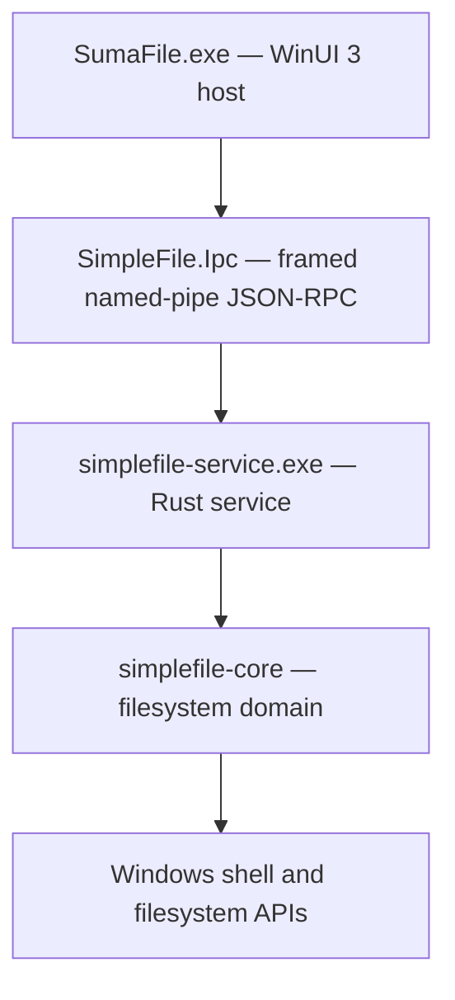

# SumaFile

<div align="center">
  
  <p><strong>A fast, native file manager for Windows power users.</strong></p>
  <p>Dual panes, independent tabs, safe transfers, advanced search, previews, archives, Git tools, and cleanup workflows in one Windows-native application.</p>
</div>

<div align="center">

[](https://github.com/conniecombs/SumaFile/actions/workflows/ci.yml)
[](https://github.com/conniecombs/SumaFile/actions/workflows/installer-smoke.yml)


[Releases](https://github.com/conniecombs/SumaFile/releases) · [Build from source](#build-from-source) · [Report a bug](https://github.com/conniecombs/SumaFile/issues/new/choose) · [Roadmap](docs/ROADMAP.md)

</div>

SumaFile is a Windows-first file manager for workflows that outgrow File Explorer. It combines an unpackaged [WinUI 3](https://learn.microsoft.com/windows/apps/winui/winui3/) desktop interface with a Rust service, keeping navigation responsive while transfers, searches, previews, archive work, and filesystem operations run outside the UI process.

> [!NOTE]
> SumaFile is under active development and currently identifies as **BETA**. The supported target is **Windows 10 version 2004 or later / Windows 11, x64**.

## Contents

- [Why SumaFile](#why-sumafile)
- [Feature highlights](#feature-highlights)
- [Install](#install)
- [Getting started](#getting-started)
- [Keyboard shortcuts](#keyboard-shortcuts)
- [Build from source](#build-from-source)
- [Architecture](#architecture)
- [Testing and quality gates](#testing-and-quality-gates)
- [Packaging and releases](#packaging-and-releases)
- [Project scope](#project-scope)
- [Documentation and support](#documentation-and-support)
- [License](#license)

## Why SumaFile

| Need | SumaFile approach |
| --- | --- |
| Compare or organize two locations | Dual panes with independent tabs, history, selection, and view state |
| Move large directory trees | Background transfer progress with operation IDs, throughput, ETA, cancellation, and conflict handling |
| Inspect files without opening several apps | Preview pane, Quick Look, metadata, checksums, properties, and text comparison |
| Find and organize scattered content | Recursive and content search, saved smart folders, labels, bookmarks, and recent locations |
| Work naturally on Windows | Native drive information, mapped network shares, Recycle Bin, Open With, terminal launch, and shell icons |
| Maintain a clean workspace | Advanced batch rename, duplicate detection, disk cleanup, clipboard history, and undo/redo |

## Feature highlights

### Browse efficiently

- Dual-pane layout with independent tabs in each pane
- Back, forward, parent, breadcrumbs, editable path entry, and path suggestions
- Drive, Quick Access, bookmark, recent-location, smart-folder, and tree navigation
- Details, list, tile, and content views with configurable columns and icon sizes
- Type-ahead and marquee selection
- Batched directory loading, virtualized file rows, and live folder watching
- Persistent workspace layout across sessions

### Transfer files safely

- Copy, cut, paste, move, drag and drop, and cross-pane transfers
- Byte-level progress, rate, ETA, cancelling state, and stable operation IDs
- Conflict actions: refuse, skip, replace, rename, or keep both
- Recycle Bin deletion and explicit permanent deletion
- Undo and redo for supported create, rename, copy, and move operations
- Clipboard history for reusing recent copy and cut selections
- Best-effort operation journal at `%LOCALAPPDATA%\SumaFile\operations.jsonl`

### Search and organize

- Instant filtering of the active directory
- Recursive filename and file-content search
- Size, date, depth, and hidden-item filters
- Batched, cancellable result streaming
- Saved smart folders
- Color labels for files and directories
- Advanced rename with live preview, templates, regular expressions, recursive targeting, sanitization, and collision warnings

### Preview and inspect

| Category | Support |
| --- | --- |
| Images | PNG, JPEG, GIF, SVG, WebP, BMP, ICO, TIFF, and available EXIF metadata |
| Video | MP4, WebM, AVI, MOV, MKV, FLV, WMV, and OGG |
| Audio | MP3, WAV, FLAC, OGG, AAC, WMA, M4A, and AIFF |
| Text and source | Conservative plain-text preview for common text and code formats |
| Documents | PDF metadata/preview and Markdown text preview |
| Fonts | TTF, OTF, WOFF, and WOFF2 |

Additional inspection tools include:

- Quick Look with `Space` and a persistent preview pane
- File and folder properties, recursive size, and item counts
- MD5, SHA-1, and SHA-256 checksums
- Side-by-side comparison for two selected UTF-8 text files
- Metadata extraction for images, PDF, audio, video, and Office packages

### Work with archives

- Browse, create, and extract ZIP, TAR, TAR.GZ/TGZ, and RAR archives
- Treat archive contents as navigable virtual paths
- Copy and move entries into, out of, and within supported archives
- Validate extraction destinations and reject unsafe paths
- Skip unsafe TAR link and special-file entries
- Install or configure optional RAR tooling from **Settings → Tools**

### Use Windows-native tools

- Drive labels, drive types, free-space reporting, and mapped-share names
- Offline or stale mapped-share detection
- Open With and default-application launch
- PowerShell, Command Prompt, Git Bash, or Windows Terminal launch
- Optional elevated PowerShell launch
- Windows shell icons and Recycle Bin integration
- Light and dark themes

### Power-user utilities

- Command palette with searchable actions
- Git branch, repository status, per-file indicators, pull, and push
- Duplicate-file finder with progress and cancellation
- Disk-cleanup workflow for locating large files
- Operation history, clipboard history, keyboard help, and configurable shortcuts
- Signed update-manifest validation with safe fallback to the Releases page

## Install

Published packages, when available, are listed on the **[SumaFile Releases page](https://github.com/conniecombs/SumaFile/releases)**. If that page does not yet contain a release, use [Build from source](#build-from-source) or a release-candidate artifact produced by the repository's **Release build** workflow.

> [!IMPORTANT]
> Download SumaFile only from this repository. The current project is in beta and may not always have a public installer available.

| Package | Intended use |
| --- | --- |
| `SumaFile_<version>_x64-winui-setup.exe` | Recommended NSIS per-user installer |
| `SumaFile_<version>_x64-winui.msi` | MSI deployment and managed environments |
| `SumaFile_<version>_x64-winui-portable.zip` | Portable payload containing `SumaFile.exe` and `simplefile-service.exe` |

The WinUI runtime is shipped self-contained. Windows 10 version 2004 or later / Windows 11 and an x64 processor are required.

## Getting started

1. Open SumaFile and choose a location from the drives, Quick Access, bookmarks, recents, or folder tree.
2. Press `F6` to open the second pane when working between two locations.
3. Press `Ctrl+T` to add a tab to the active pane.
4. Use `Space` for Quick Look or enable the preview pane for persistent inspection.
5. Use `Ctrl+F` to filter or search and `Ctrl+Shift+P` to open the command palette.
6. Review **Settings** for appearance, columns, navigation, deletion behavior, shortcuts, tools, and updates.

### Settings at a glance

| Section | Controls |
| --- | --- |
| Appearance | Theme, default view, and icon size |
| File List | Columns, hidden items, folder metrics, folder-first sorting, and Git indicators |
| Navigation | Start location, tab behavior, tree behavior, and recent locations |
| Behavior | Deletion confirmation and Recycle Bin defaults |
| Shortcuts | Inspect, remap, or reset keyboard bindings |
| Tools | Git status and optional RAR tooling |
| Updates | Current version and signed update checks |
| About | Product, version, and repository information |

## Keyboard shortcuts

These defaults can be remapped under **Settings → Shortcuts**. Press `F1` inside SumaFile for the complete live shortcut sheet.

| Shortcut | Action | Shortcut | Action |
| --- | --- | --- | --- |
| `Ctrl+L` / `Alt+D` | Focus path bar | `Ctrl+F` | Focus search |
| `Alt+Left` / `Alt+Right` | Back / forward | `Alt+Up` / `Backspace` | Parent folder |
| `Ctrl+T` / `Ctrl+W` | New / close tab | `Ctrl+Tab` | Next tab |
| `F6` | Toggle dual pane | `Tab` | Switch active pane |
| `Alt+1` / `Alt+2` | Focus left / right pane | `Ctrl+Alt+C` / `Ctrl+Alt+M` | Copy / move to other pane |
| `Ctrl+C` / `Ctrl+X` / `Ctrl+V` | Copy / cut / paste | `Ctrl+Shift+V` | Clipboard history |
| `F2` | Rename | `Delete` / `Shift+Delete` | Recycle / permanently delete |
| `Ctrl+N` / `Ctrl+Shift+N` | New file / folder | `Ctrl+Z` / `Ctrl+Y` | Undo / redo |
| `Space` | Quick Look | `Ctrl+Shift+P` | Command palette |
| `F4` | Open terminal | `F5` | Refresh |

## Build from source

SumaFile's desktop application must be built on Windows.

### Prerequisites

| Tool | Required version or component |
| --- | --- |
| Windows | Windows 10 version 2004+ or Windows 11, x64 |
| [Node.js](https://nodejs.org/) | 24 or later; used for repository orchestration and checks |
| [Rust](https://rustup.rs/) | Stable `x86_64-pc-windows-msvc` toolchain |
| [.NET SDK](https://dotnet.microsoft.com/download) | 10.x |
| Visual Studio Build Tools | 2022 with **Desktop development with C++** |
| Windows SDK | 10.0.19041.0 or later |
| [NSIS](https://nsis.sourceforge.io/) | Optional; required to build the setup executable |
| [WiX Toolset](https://wixtoolset.org/) | Optional WiX v3 tools; required to build the MSI |

### Clone and run

```powershell
git clone https://github.com/conniecombs/SumaFile.git
cd SumaFile
npm run dev
```

`npm run dev` builds `simplefile-service` and starts the WinUI host. To use a service binary from another location, set `SIMPLEFILE_SERVICE_PATH` before launching.

### Common development commands

```powershell
# Build the WinUI solution
npm run build:winui

# Run the WinUI test suite
npm run check:winui

# Run repository invariants and generated-code checks
npm run check

# Format-check, test, and lint all Rust crates
npm run check:rust
```

See [src-winui/README.md](src-winui/README.md) for WinUI-specific build and startup troubleshooting.

## Architecture

SumaFile deliberately separates the desktop shell from filesystem work:



| Layer | Responsibility |
| --- | --- |
| `SimpleFile.App` | Windows, dialogs, controls, shell integration, and presentation |
| `SimpleFile.Core` | Workspace state, panes, tabs, transfers, settings, menus, and view models |
| `SimpleFile.Ipc` | Typed client, framing, request/response multiplexing, events, and client cancellation |
| `simplefile-service` | Process boundary, request dispatch, background jobs, progress, and service lifetime |
| `simplefile-core` | File operations, search, archives, preview, metadata, Git, drives, cleanup, and updater logic |

The UI launches the Rust service in a Windows job object. The service closes with SumaFile, while files opened in external applications are allowed to outlive it. The IPC contract is generated from `ipc/schema/v1` and currently covers **76 domain commands and 6 emitted events**.

### Repository map

```text
SumaFile/
├── src-winui/
│   ├── SimpleFile.App/          WinUI 3 desktop host
│   ├── SimpleFile.Core/         Workspace and UI-domain logic
│   ├── SimpleFile.Ipc/          Named-pipe JSON-RPC client
│   └── SimpleFile.Tests/        xUnit tests
├── crates/
│   ├── simplefile-core/         Reusable Rust file-manager domain
│   ├── simplefile-ipc/          Framing and protocol types
│   └── simplefile-service/      Shipping Rust service process
├── ipc/schema/                  Source IPC contract
├── packaging/winui/             NSIS, WiX, and application icon
├── scripts/                     Checks, build, release, and smoke scripts
├── docs/                        User, architecture, migration, and release docs
├── build_notes/                 Historical engineering notes
└── .github/workflows/           CI, release, and installer validation
```

## Testing and quality gates

Run the following before opening a pull request:

```powershell
npm run check
npm run check:winui
npm run check:rust
npm run check:security
```

| Command | Verifies |
| --- | --- |
| `npm run check` | Generated IPC bindings, schema, identity, updater, workflows, supported surface, assets, packaging, and parity gate |
| `npm run check:winui` | WinUI build and xUnit tests |
| `npm run check:rust` | Rust formatting, unit/integration tests, and Clippy with warnings denied |
| `npm run check:security` | Rust dependency audit |
| `npm run check:release` | Repository checks, Rust checks, and dependency audit |
| `npm run release:build` | Release payload, portable package, installers where tools exist, and applicable smoke checks |

GitHub Actions separates fast pull-request checks from slower packaging validation:

| Workflow | Trigger and purpose |
| --- | --- |
| [CI](.github/workflows/ci.yml) | Pushes and pull requests; repository, Rust, WinUI, security, and Windows x64 build gates |
| [Release build](.github/workflows/release-build.yml) | Manual release-candidate build without publishing a GitHub Release |
| [Installer Smoke](.github/workflows/installer-smoke.yml) | Nightly or manual payload, NSIS, MSI, and upgrade validation |
| [Release](.github/workflows/release.yml) | Version validation, signed artifacts, draft release creation, and optional publication |

## Packaging and releases

`npm run build:winui:release` writes release output under `dist/winui/`:

- `payload/` with the self-contained WinUI application and Rust service
- Portable zip
- NSIS setup executable when NSIS is installed
- MSI when WiX v3 is installed
- `latest-winui.json` update metadata

Production releases require a SHA-256 digest, payload size, trusted repository URL, and Ed25519 signature before SumaFile enables in-app installation. Missing or invalid signed metadata leaves the user on the manual Releases path.

Release maintainers should follow [.github/RELEASE.md](.github/RELEASE.md) and [docs/UPDATER_RELEASE.md](docs/UPDATER_RELEASE.md).

### Version identity

The current user-facing version is **BETA**. Technical fields that require semantic numeric versions use `0.1.0`. When changing the version, keep these sources aligned:

- `src-winui/Directory.Build.props`
- `crates/simplefile-core/src/lib.rs`
- `crates/simplefile-service/Cargo.toml` and `Cargo.lock`
- README badge, changelog, and release notes

## Project scope

SumaFile's current Windows branch supports:

- Local disks and directories
- Removable storage
- Mapped network drives and shares
- Local-file archives, previews, metadata, search, Git, and cleanup tools
- Windows x64 NSIS, MSI, and portable packaging

The following remain intentionally outside the current scope:

- App-managed storage-provider integrations or mount management
- macOS and Linux desktop packages

See the [roadmap](docs/ROADMAP.md) for current priorities.

## Documentation and support

| Document | Purpose |
| --- | --- |
| [Changelog](docs/CHANGELOG.md) | Notable product changes and version history |
| [Roadmap](docs/ROADMAP.md) | Current priorities and explicit non-goals |
| [Contributing](docs/CONTRIBUTING.md) | Development conventions and pull-request checks |
| [Security policy](docs/SECURITY.md) | Sensitive files and vulnerability-reporting guidance |
| [Support guide](docs/SUPPORT.md) | Diagnostic information to include with a report |
| [Updater release guide](docs/UPDATER_RELEASE.md) | Signed update and publication procedure |
| [WinUI parity gate](docs/winui-migration/parity-gate.md) | Migration feature coverage and retirement lock |

For bugs and feature requests, use the repository's [issue templates](https://github.com/conniecombs/SumaFile/issues/new/choose). Include the Windows version, SumaFile version, package type, exact reproduction steps, and redacted logs where applicable.

Diagnostic files may be written to:

```text
%LOCALAPPDATA%\SumaFile\startup.log
%LOCALAPPDATA%\SumaFile\service.log
%LOCALAPPDATA%\SumaFile\operations.jsonl
```

Do not post private filesystem paths, signing material, or unredacted personal data. Security-sensitive reports should follow [docs/SECURITY.md](docs/SECURITY.md).

## License

SumaFile is proprietary software. Copyright © 2024–2026 conniecombs. All rights reserved.

Access to this repository does not grant permission to use, copy, modify, redistribute, sublicense, host, resell, or create derivative works without prior written permission. See [LICENSE](LICENSE) for the complete terms. Third-party components remain governed by their respective licenses.
