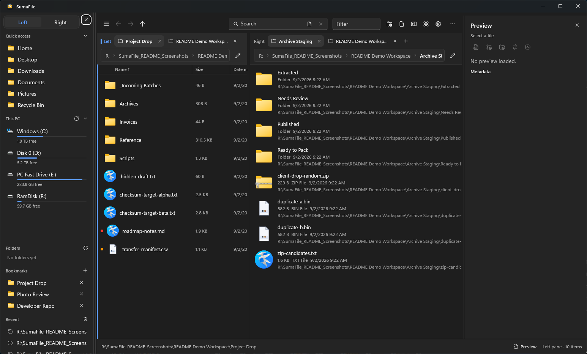
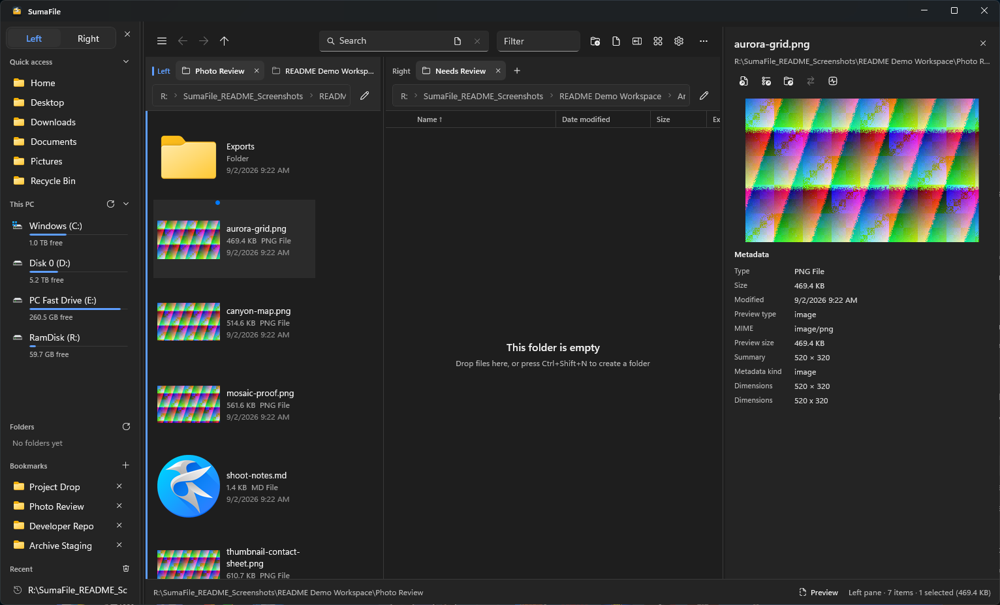
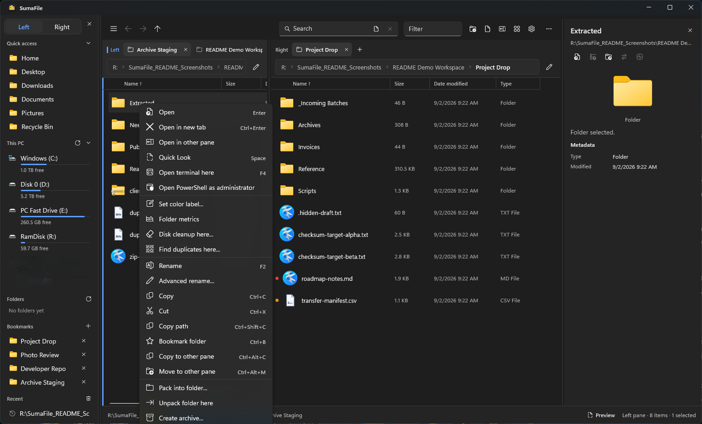
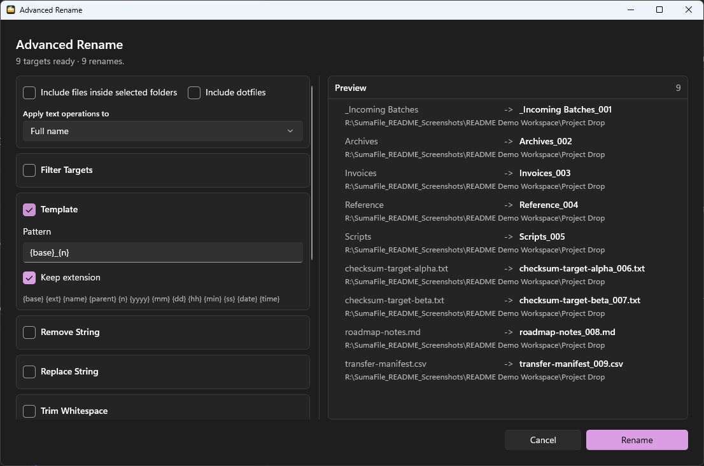
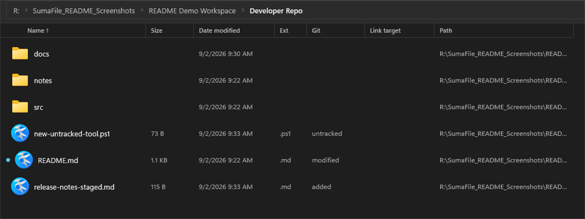

# SumaFile

[](https://github.com/conniecombs/SumaFile/actions/workflows/ci.yml)
[](https://github.com/conniecombs/SumaFile/actions/workflows/release.yml)
[](https://github.com/conniecombs/SumaFile/actions/workflows/installer-smoke.yml)


[](LICENSE)

SumaFile is a native Windows file manager for people who work across several
folders at once and need more than a basic file list. It pairs a WinUI 3 desktop
shell with a Rust filesystem service so browsing, transfers, search, previews,
archives, checksums, Git status, and cleanup tools can stay responsive in one
local-first app.

**Repository topics:** `windows`, `file-manager`, `winui-3`, `rust`,
`named-pipe-ipc`, `dual-pane`, `tabs`, `file-preview`, `advanced-rename`,
`archive-manager`, `checksum`, `git-status`, `windows-installer`,
`local-first`.

## Contents

- [Screenshots](#screenshots)
- [Status](#status)
- [Highlights](#highlights)
- [Install](#install)
- [Use SumaFile](#use-sumafile)
- [Feature Reference](#feature-reference)
- [Settings and State](#settings-and-state)
- [Development](#development)
- [Architecture](#architecture)
- [Testing and Verification](#testing-and-verification)
- [Release and Tags](#release-and-tags)
- [Documentation Map](#documentation-map)
- [Security](#security)
- [Known Limitations](#known-limitations)
- [Support](#support)
- [License](#license)

## Screenshots

The screenshots below were captured locally from generated sample files and
folders on an `R:` drive. The app does not require an `R:` drive; normal local
drives, removable media, mapped network shares, and archive files are the
supported storage surfaces.

### Dual-pane browsing



Dual panes, pane-local tabs, breadcrumbs, bookmarks, drive status, details
columns, and the preview rail are visible in the default workspace flow.

### Preview pane



The preview pane can stay open while browsing. It shows image, text, PDF, media,
font, metadata, and checksum workflows without leaving the file manager.

### Right-click actions



The context menu is a primary command surface for opening in tabs or the other
pane, Quick Look, terminals, color labels, folder metrics, duplicate checks,
rename tools, copy/move-to-pane actions, packing, unpacking, archive creation,
and delete choices.

### Advanced Rename



Advanced Rename builds a live plan before anything is written. It supports
templates, numbering, filtering, regex remove/replace, whitespace cleanup,
separator conversion, extension transforms, recursive folder targeting, and
invalid-name or duplicate-target warnings.

### Git status columns



This focused crop shows the developer column preset with `untracked`,
`modified`, and `added` labels beside normal file metadata, so local
repositories can be reviewed without jumping between Explorer and a terminal.

## Status

| Area | Current state |
| --- | --- |
| Product version | `1.0.0` |
| Platform | Windows 10 2004+ / Windows 11, x64 |
| UI | Unpackaged WinUI 3 desktop app |
| Backend | Rust `simplefile-service` over named-pipe JSON-RPC |
| Release artifacts | NSIS setup, MSI, portable ZIP, updater manifest |
| Storage scope | Local folders, local drives, removable media, mapped network shares, archives |
| License | [MIT](LICENSE) |

The active application is the WinUI host under `src-winui/` plus the Rust crates
under `crates/`. Historical migration notes remain in `docs/winui-migration/`,
but the Svelte/Tauri surface is not the shipping UI for this branch.

## Highlights

| Need | SumaFile capability |
| --- | --- |
| Work in two locations | Dual-pane browsing with independent pane history, tabs, sort, view, and selection |
| Keep workspace context | Saved layouts for panes, tabs, columns, preview width, sidebar state, and pane split |
| Move files confidently | Copy/move progress, cancellation, conflict choices, Recycle Bin delete, and undo/redo |
| Inspect before opening | Persistent preview pane, Quick Look, metadata, checksums, properties, and compare |
| Organize messy folders | Tags, bookmarks, recents, smart folders, duplicate finder, cleanup, and Advanced Rename |
| Work with archives | Create, list, view, extract, pack, and unpack supported archives |
| Handle developer folders | Git status column, Git pull/push commands, terminal launch, and Open With preferences |
| Stay Windows-native | Drive labels, network-share status, shell icons, Windows installers, and Windows shortcuts |

## Install

Download the latest Windows release from
[GitHub Releases](https://github.com/conniecombs/SumaFile/releases).

| Artifact | Recommended use |
| --- | --- |
| `SumaFile_1.0.0_x64-winui-setup.exe` | Normal per-user installation |
| `SumaFile_1.0.0_x64-winui.msi` | MSI deployment or installer validation |
| `SumaFile_1.0.0_x64-winui-portable.zip` | Portable, extracted-folder usage |
| `latest-winui.json` | Signed updater metadata for published releases |

Requirements:

- Windows 10 version 2004 or newer, or Windows 11
- x64 Windows
- Optional: 7-Zip for `.7z` workflows, or set `SIMPLEFILE_7Z`
- Optional: RAR tooling through Settings -> Tools, or set `SIMPLEFILE_RAR`

After installing, open Settings -> Updates to check published releases. Builds
with trusted updater metadata can download and launch the NSIS setup from inside
the app. Builds without complete trusted metadata fall back to the release page.

## Use SumaFile

1. Open SumaFile.
2. Choose a location from Quick Access, drives, bookmarks, recents, smart
   folders, the optional folder tree, or the editable path bar.
3. Press `F6` to open or close the second pane.
4. Press `Ctrl+T` to open a tab in the active pane.
5. Leave Preview open for continuous inspection, or press `Space` for Quick
   Look on the selected item.
6. Use right-click menus, toolbar buttons, or `Ctrl+Shift+P` for command
   palette access.
7. Save repeatable pane/tab/column setups from View options -> Layouts.

## Feature Reference

### Navigation and Layout

- Dual-pane browsing with independent active-pane state
- Pane-local tabs with history, close, switch, and direct tab shortcuts
- Breadcrumb navigation plus an editable path bar with folder suggestions
- Quick Access, drives, bookmarks, recent locations, smart folders, and folder
  tree sections
- Details, list, tiles, and content views
- Per-pane view style, icon size, sort column, and sort direction
- Column presets: default, details, media, developer, and photo
- Explorer-style column resizing, size-to-fit, and horizontal scrolling
- Marquee selection, multi-selection, type-ahead selection, and live directory
  refresh
- Recycle Bin as a browsable location with restore, permanent delete, and empty
  actions

### File Operations

- Create file and folder
- Rename and Advanced Rename
- Copy, cut, paste, drag, drop, copy to other pane, and move to other pane
- Transfer progress with bytes, totals, rate, ETA, cancellation, and operation
  history
- Conflict handling for skip, replace, keep both, or fail
- Recycle Bin delete and permanent delete
- Undo/redo for create, rename, copy, move, and Recycle Bin delete flows
- Clipboard history for recent copy/cut sets
- Operation journal written to `%LOCALAPPDATA%\SumaFile\operations.jsonl`

### Preview and Inspection

| Kind | Support |
| --- | --- |
| Images | PNG, JPG/JPEG, GIF, SVG, WebP, BMP, ICO, TIFF |
| PDF | Path-backed PDF preview and metadata |
| Video | MP4, WebM, AVI, MOV, MKV, FLV, WMV, OGG |
| Audio | MP3, WAV, FLAC, OGG, AAC, WMA, M4A, AIFF |
| Text and code | Plain text, source files, scripts, config, logs |
| Markdown | Text preview |
| Fonts | TTF, OTF, WOFF, WOFF2 |
| Other files | Shell icon and basic metadata fallback |

Inspection tools include:

- Preview pane with Open, Open With, Reveal in folder, Compare, and Checksum
  actions
- Quick Look for focused inspection
- Properties dialog with path, type, size, timestamps, and attributes
- Image dimensions and EXIF where available
- Office/PDF/media metadata where available
- MD5, SHA-1, and SHA-256 checksums
- Text diff for two small UTF-8 files
- Binary comparison with hex/ASCII rows for images, executables, oversized text,
  invalid UTF-8, or other binary content

### Search and Smart Folders

- Quick filter for the visible directory
- Recursive filename search
- Optional content search from the search box
- Filters for size, date, depth, and hidden-file inclusion
- Batched, cancellable search results for large trees
- Smart folders saved from reusable search criteria

### Archives

| Format | Extension(s) | Support |
| --- | --- | --- |
| ZIP | `.zip` | Built in |
| TAR | `.tar` | Built in |
| TAR.GZ | `.tar.gz`, `.tgz` | Built in |
| RAR | `.rar` | Optional RAR tooling |
| 7-Zip | `.7z` | Installed 7-Zip or `SIMPLEFILE_7Z` |

Archive commands can list contents, view archives, extract here, extract to a
folder, extract to a chosen destination, create archives, pack selections into a
folder, and unpack folders in place.

Extraction validates final output paths before writing. TAR extraction skips
links and special entries that could escape the destination.

### Organization

- Color labels and file/folder tags
- Bookmarks and recent locations
- Smart folders
- Folder metrics
- Duplicate finder
- Advanced Rename with live preview and collision checks
- Settings-controlled hidden/system file visibility
- Keep-folders-on-top sorting mode

### Git and Developer Tools

- Developer column preset with Git status labels
- Git pull and Git push commands for the current directory
- Open terminal here with `F4`
- Elevated PowerShell launch
- Open With menu and chooser
- Pinned and recent Open With apps per extension
- Command palette with searchable app commands

## Settings and State

Settings is organized into:

| Section | Controls |
| --- | --- |
| Appearance | Theme, default view, icon size, column preset, hidden files |
| Navigation | Start location, custom path, new-tab behavior, sidebar sections, recent history |
| Behavior | Delete confirmation, folder sorting, folder sizes, Git integration |
| Shortcuts | Live shortcut list |
| Tools | Optional RAR tooling |
| Updates | Version, update check, install action |
| About | Product, version, repository, and build metadata |

Startup can open Home, the last used workspace, or a custom path. Last-used
state persists panes, active pane, tabs, view mode, icon size, sort, and filter
context. Named layouts are separate snapshots available from View options ->
Layouts.

Persistent compatibility data stays at:

```text
%APPDATA%\com.simplefile.desktop
```

No manual import is needed for normal SimpleFile-to-SumaFile use. SumaFile
keeps this path for compatibility with earlier SimpleFile builds and also falls
back to legacy `SimpleFile` / `SumaFile` app-data folders when an existing
metadata database is found there.

Runtime diagnostics are written under:

```text
%LOCALAPPDATA%\SumaFile\startup.log
%LOCALAPPDATA%\SumaFile\operations.jsonl
```

## Keyboard Shortcuts

Press `F1` or `Ctrl+?` in SumaFile for the live shortcut list.

| Shortcut | Action |
| --- | --- |
| `Ctrl+L` / `Alt+D` | Focus path bar |
| `Enter` | Open selected item |
| `Ctrl+Enter` | Open folder in new tab |
| `Alt+Enter` | Properties |
| `Alt+Home` | Go home |
| `Alt+Up` / `Backspace` | Parent folder |
| `Alt+Left` / `Alt+Right` | Back / forward |
| `F5` | Refresh |
| `F6` | Open or close second pane |
| `Tab` | Switch active pane when dual pane is open |
| `Alt+1` / `Alt+2` | Focus left / right pane |
| `Ctrl+Shift+Left` / `Ctrl+Shift+Right` | Focus left / right pane |
| `Ctrl+T` / `Ctrl+W` | New tab / close tab |
| `Ctrl+Tab` / `Ctrl+Shift+Tab` | Next / previous tab |
| `Ctrl+1`-`Ctrl+9` | Jump to tab; `9` means last tab |
| `F2` | Rename |
| `Delete` / `Shift+Delete` | Recycle Bin delete / permanent delete |
| `Ctrl+C` / `Ctrl+X` / `Ctrl+V` | Copy / cut / paste |
| `Ctrl+Shift+C` | Copy path |
| `Ctrl+Shift+V` | Clipboard history |
| `Ctrl+A` | Select all |
| `Ctrl+N` / `Ctrl+Shift+N` | New file / new folder |
| `Ctrl+Z` | Undo |
| `Ctrl+Y` / `Ctrl+Shift+Z` | Redo |
| `Ctrl+Alt+C` / `Ctrl+Alt+M` | Copy / move to other pane |
| `Space` | Quick Look |
| `Ctrl+H` | Show or hide hidden/system files |
| `Ctrl+B` | Bookmark current folder |
| `Ctrl+Mouse wheel` | Change icon size |
| `Ctrl+F` / `F3` | Focus search |
| `Ctrl+Shift+P` | Command palette |
| `F4` | Open terminal here |
| `Escape` | Close transient UI, clear filter, or clear selection |

## Development

### Prerequisites

| Tool | Version | Purpose |
| --- | --- | --- |
| Windows | Windows 10 2004+ or Windows 11 x64 | Target platform |
| Node.js | 24+ | Root scripts and checks |
| Rust | Stable MSVC toolchain | `simplefile-core`, `simplefile-ipc`, `simplefile-service` |
| .NET SDK | 10+ | WinUI solution and tests |
| Windows SDK | 10.0.19041+ | WinUI target platform |
| NSIS | Optional | NSIS setup executable |
| WiX v3 | Optional | MSI package |
| 7-Zip | Optional | `.7z` archive operations |

### Run Locally

```powershell
git clone https://github.com/conniecombs/SumaFile.git
cd SumaFile
npm run dev
```

`npm run dev` builds the Rust service and starts the WinUI app. To run the UI
against a specific service binary:

```powershell
$env:SIMPLEFILE_SERVICE_PATH = "R:\path\to\simplefile-service.exe"
npm run dev:winui
```

Useful local-only overrides:

| Variable | Purpose |
| --- | --- |
| `SIMPLEFILE_SERVICE_PATH` | Use a specific `simplefile-service.exe` |
| `SIMPLEFILE_APP_DATA_DIR` | Redirect app data for fixtures or tests |
| `SIMPLEFILE_METADATA_DB` | Point settings/tags to a specific metadata database |
| `SIMPLEFILE_7Z` | Use a specific `7z.exe` |
| `SIMPLEFILE_RAR` | Use a specific RAR tool |
| `SIMPLEFILE_UPDATE_MANIFEST_PATH` | Test updater metadata from a local file |
| `SIMPLEFILE_UPDATE_MANIFEST_JSON` | Test updater metadata from inline JSON |

### Common Commands

Run these from the repository root.

| Command | Purpose |
| --- | --- |
| `npm run dev` | Build service and run the WinUI app |
| `npm run build:winui` | Build the WinUI solution in Debug |
| `npm run check:winui` | Run the WinUI xUnit suite |
| `npm run check:rust` | Rust format check, tests, and Clippy with warnings denied |
| `npm run check` | Repo guard scripts for IPC, identity, updater, workflows, packaging, and parity |
| `npm run check:release` | `check` + Rust checks + dependency audit |
| `npm run build` | Build release payload/installers through the WinUI release script |
| `npm run release:build` | Local release pipeline alias |
| `npm run generate:ipc-bindings` | Regenerate schema-derived Rust/C# IPC bindings |
| `npm run smoke:winui` | Launch smoke for built payload |
| `npm run smoke:winui-file-ops` | File operation smoke |
| `npm run smoke:winui-msi` | MSI extraction/launch smoke |
| `npm run smoke:winui-installer` | NSIS install/launch/uninstall smoke |
| `npm run smoke:winui-upgrade` | Previous release to local installer upgrade smoke |
| `npm run smoke:winui-upgrade-from-ref` | Upgrade smoke from a specific Git ref |

## Architecture

```text
SumaFile.exe
  WinUI 3 desktop shell
  panes, tabs, sidebar, dialogs, preview, transfers, settings
        |
        | length-prefixed named-pipe JSON-RPC
        v
simplefile-service.exe
  dispatcher, watcher, search, progress, cancellation
        |
        v
simplefile-core
  file ops, archive, preview, metadata, checksum, compare,
  drives, tags, smart folders, Git, updater, shell helpers
```

Important contracts:

- The app owns one service process per UI process.
- The service is tied to the UI process with a Windows job object, while files
  opened through the shell can outlive SumaFile.
- IPC contracts live in `ipc/schema/v1`; generated Rust and C# bindings must
  remain synchronized.
- Windows packaging must ship `SumaFile.exe`, `simplefile-service.exe`,
  `resources.pri`, XBF files, and Windows App SDK dependencies together.
- Runtime identity is SumaFile, while selected internal namespaces and
  compatibility paths intentionally keep the SimpleFile name.

## Project Layout

```text
SumaFile/
|-- src-winui/
|   |-- SimpleFile.App/       WinUI window, dialogs, preview, toolbar, panes
|   |-- SimpleFile.Core/      Workspace, settings, menus, transfers, layout state
|   |-- SimpleFile.Ipc/       Named-pipe JSON-RPC client and generated bindings
|   `-- SimpleFile.Tests/     xUnit tests for WinUI/core/IPC behavior
|-- crates/
|   |-- simplefile-core/      Filesystem, archive, preview, metadata, Git logic
|   |-- simplefile-ipc/       Protocol constants, framing, schema tests
|   `-- simplefile-service/   Rust named-pipe service process
|-- ipc/schema/v1/            JSON-RPC command, type, event, and golden files
|-- packaging/winui/          NSIS, WiX, and Windows assets
|-- scripts/                  Checks, release scripts, smoke tests, codegen
|-- docs/                     Roadmap, support, updater, release, migration docs
|-- build_notes/              Maintainer notes from hardening and migration work
|-- .github/workflows/        CI, release, release-build, installer smoke
|-- package.json              Root command runner
|-- Cargo.toml                Rust workspace
`-- LICENSE                   MIT License
```

## Testing and Verification

Recommended local development gate:

```powershell
npm run build:winui
npm run check:winui
npm run check
npm run check:rust
git diff --check
```

Release-quality gate:

```powershell
npm run check:release
npm run release:build
npm run smoke:winui
npm run smoke:winui-file-ops
npm run smoke:winui-msi
npm run smoke:winui-installer
npm run smoke:winui-upgrade
```

| Gate | Coverage |
| --- | --- |
| `check:ipc-generated` | Generated Rust/C# IPC bindings match schema |
| `check:ipc-schema` | Schema, service dispatcher, and C# client stay aligned |
| `check:identity` | Current-facing files use SumaFile repository identity |
| `check:updater` | Updater URL, signature, and manifest wiring |
| `check:workflows` | GitHub Actions workflow surface |
| `check:provider-surface` | External account-backed storage surfaces remain out of scope |
| `check:windows-assets` | Windows app and packaging assets |
| `check:winui-packaging` | NSIS/MSI/release-script contracts |
| `check:winui-parity-gate` | WinUI parity rows remain PASS/WAIVED |
| `check:winui` | xUnit app/core/IPC tests |
| `check:rust` | Rust fmt, tests, and Clippy |
| `check:security` | Rust dependency audit |

Installer and upgrade smokes are slower by design. Use them before shipping
release assets or changing packaging/update behavior.

## Release and Tags

Release outputs are written under `dist/winui/` by
`scripts/build-winui-release.ps1`.

| Output | Contents |
| --- | --- |
| `payload/` | Runnable unpackaged app folder |
| `SumaFile_<version>_x64-winui-portable.zip` | Portable package |
| `SumaFile_<version>_x64-winui-setup.exe` | NSIS per-user installer |
| `SumaFile_<version>_x64-winui.msi` | MSI package |
| `latest-winui.json` | Signed updater manifest |

Version fields that must stay synchronized:

- `src-winui/Directory.Build.props`: `<Version>` and
  `<InformationalVersion>`
- `crates/simplefile-core/src/lib.rs`: `APP_DISPLAY_VERSION`
- `crates/simplefile-core/Cargo.toml`
- `crates/simplefile-ipc/Cargo.toml`
- `crates/simplefile-service/Cargo.toml`
- `Cargo.lock`
- README badges and install artifact names
- `docs/CHANGELOG.md`

Git release tags use `vMAJOR.MINOR.PATCH`, for example `v1.0.0`.

Before creating a release tag:

1. Confirm the version fields above match.
2. Run `npm run check:release`.
3. Run the WinUI smoke commands required by `docs/RELEASE_1.0.0.md`.
4. Confirm the Installer Smoke workflow succeeds on the release commit.
5. Dispatch or create the GitHub release for the matching tag.

More detail lives in [.github/RELEASE.md](.github/RELEASE.md) and
[docs/UPDATER_RELEASE.md](docs/UPDATER_RELEASE.md).

## Documentation Map

| Document | Use it for |
| --- | --- |
| [docs/CHANGELOG.md](docs/CHANGELOG.md) | Current and historical changes |
| [docs/ROADMAP.md](docs/ROADMAP.md) | Near-term priorities and branch scope |
| [docs/FEATURE_OPPORTUNITIES.md](docs/FEATURE_OPPORTUNITIES.md) | Candidate product gaps and recently closed gaps |
| [docs/CONTRIBUTING.md](docs/CONTRIBUTING.md) | Contributor workflow and expectations |
| [docs/SUPPORT.md](docs/SUPPORT.md) | Useful details for reports |
| [docs/SECURITY.md](docs/SECURITY.md) | Vulnerability reporting and sensitive-file rules |
| [docs/UPDATER_RELEASE.md](docs/UPDATER_RELEASE.md) | Signed updater releases |
| [docs/RELEASE_1.0.0.md](docs/RELEASE_1.0.0.md) | 1.0.0 release checklist and dogfood plan |
| [.github/RELEASE.md](.github/RELEASE.md) | Release process |
| [src-winui/README.md](src-winui/README.md) | WinUI host build/run notes |
| [docs/winui-migration/](docs/winui-migration/) | Historical migration architecture and parity records |

## Security

- Do not commit updater private keys, signing keys, `.env` files, local secrets,
  personal settings exports, or logs containing private paths.
- Gitignored sensitive locations include `.secrets/`, `*.key`, `.env`, and
  `.env.*`.
- Archive extraction validates destination paths before writing.
- TAR extraction skips links and special entries.
- Open With refuses executable/script payload files as launch targets.
- Report vulnerabilities through [docs/SECURITY.md](docs/SECURITY.md).

## Known Limitations

- SumaFile 1.0.0 is Windows-only.
- The first 1.0.0 install is manual; in-app update installation requires a
  newer published release with signed `latest-winui.json` metadata.
- `.7z` workflows require external 7-Zip support.
- RAR creation/extraction depends on optional RAR tooling.
- Account-backed storage integrations are intentionally out of scope for
  this branch.
- Some Windows-reserved shortcuts may not be assignable; shortcut remapping,
  import, and export live in Settings -> Shortcuts.

## Support

When reporting an issue, include:

- Windows version
- SumaFile version from Settings -> About or the About dialog
- Whether you used the setup executable, MSI, portable ZIP, or a dev run
- The exact path/workflow where the issue happened, with private path segments
  redacted if needed
- Relevant snippets from `%LOCALAPPDATA%\SumaFile\startup.log`
- Relevant snippets from `%LOCALAPPDATA%\SumaFile\operations.jsonl`
- Whether `npm run smoke:winui`, `npm run smoke:winui-file-ops`,
  `npm run smoke:winui-msi`, and `npm run smoke:winui-installer` pass locally
  when the issue involves install, startup, updates, or filesystem operations

See [docs/SUPPORT.md](docs/SUPPORT.md) for the full support checklist.

## License

SumaFile is open-source software licensed under the [MIT License](LICENSE).

Copyright (c) 2024-2026 conniecombs.

Third-party libraries remain governed by their own license terms.
