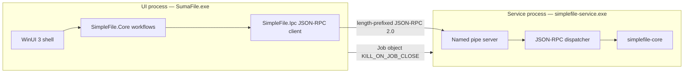
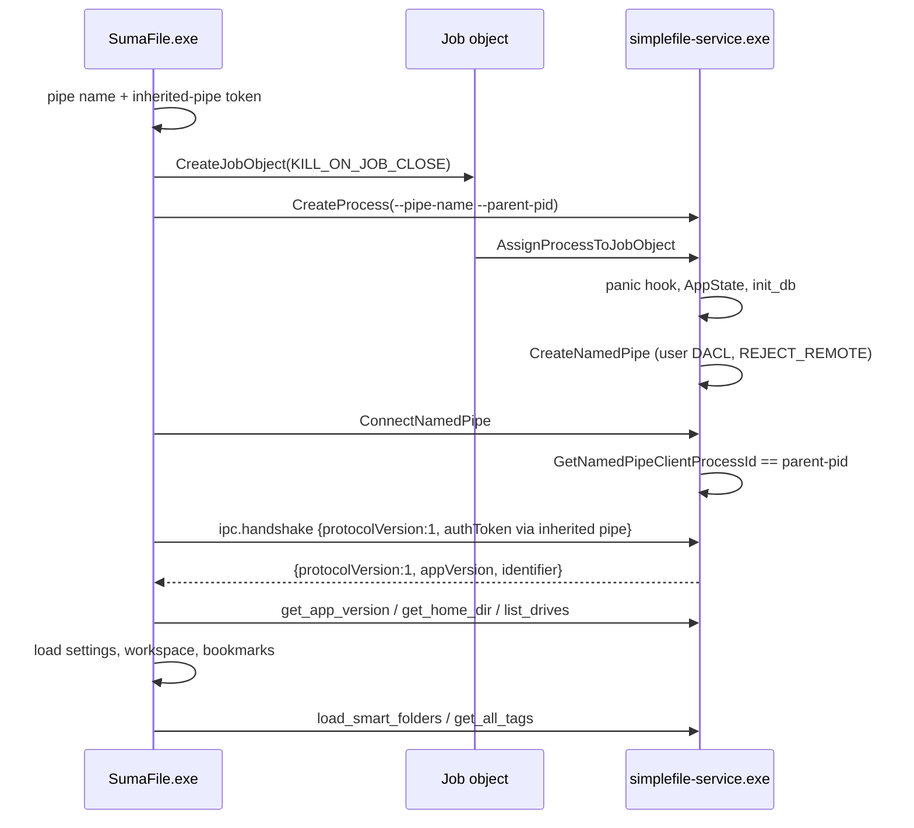
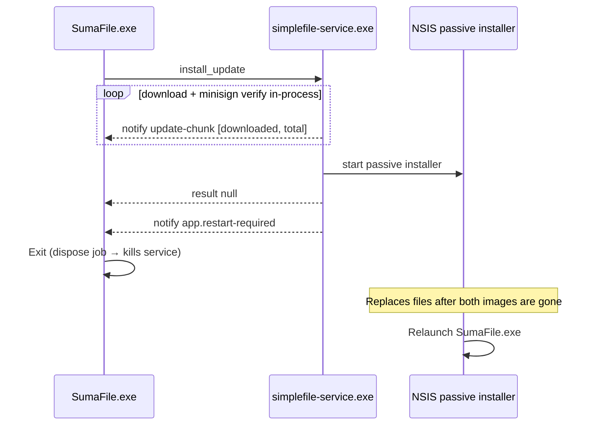
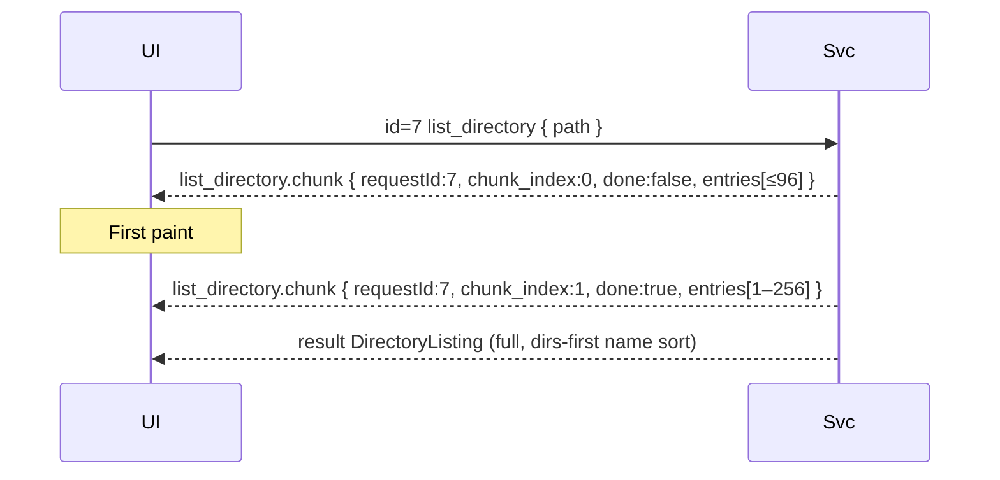

# WinUI 3 + Rust IPC Architecture

| Field | Value |
| --- | --- |
| **Title** | SimpleFile-Windows WinUI 3 + Rust IPC Architecture |
| **Author** | SumaFile Team |
| **Date** | 2026-08-14 |
| **Status** | Historical design (Svelte/Tauri UI retired 2026-08-15) |
| **Source tree** | `R:\Repos\SimpleFile-Windows` |
| **Contract source** | [`docs/winui-migration/inventory.md`](inventory.md) |
| **Current product** | SumaFile 1.0.0 (`com.simplefile.desktop`) |

This is a historical design document from before the Svelte/Tauri UI was retired. The original 74-command / 5-event inventory remains migration context; the current parity gate is authoritative for the live service command count.

---

## Overview

The retired SimpleFile Tauri 2 process was a Svelte 5 WebView talking to a Rust backend through `invoke`, `listen`, and one `Channel` (`list_directory`). `src-tauri/src/lib.rs` registered 74 `#[tauri::command]` handlers, three plugins (`dialog`, `opener`, `updater`), SQLite `DbState`, and shared `AppState`. Settings and workspace state lived in WebView `localStorage`; tags lived in `{app_data_dir}/metadata.db`; smart folders lived in `{app_data_dir}/smart_folders.json`.

The migration kept that Rust domain as a sibling IPC service and replaced the renderer and Tauri host glue with a native C# WinUI 3 UI process. The chosen transport is **Windows named pipes + JSON-RPC 2.0** (length-prefixed frames). One UI process owns exactly one service process, connected on a per-session / per-PID pipe so two SumaFile instances never collide. The Svelte/Tauri host and frontend were retired after the parity gates passed.

---

## Background & Motivation

The shipping architecture is documented in [`docs/winui-migration/inventory.md`](inventory.md). Relevant facts verified in the tree:

- Single crate `src-tauri` package `simplefile` 1.1.0, identifier `com.simplefile.desktop` (`src-tauri/Cargo.toml`, `src-tauri/tauri.conf.json`).
- Commands return `Result<T, String>`. Errors are human-readable strings, including the `CONFLICT:` prefix used by `copy_entry` / `move_entry` / resolved transfers (`src-tauri/src/lib.rs` tests, `src-tauri/src/progress.rs`).
- Tauri JS args are camelCase mappings of Rust snake_case (`defaultPath`, `newName`, `conflictAction`, `onChunk`). Result payloads stay snake_case as serde serializes `models.rs`.
- `list_directory` streams via `tauri::ipc::Channel<DirectoryListingChunk>` (`FIRST_CHUNK_SIZE = 96`, `LATER_CHUNK_SIZE = 256` in `src-tauri/src/dir_list.rs`) and then returns the full sorted `DirectoryListing`.
- Events actually emitted: `file-change`, `operation-progress`, `search-results-batch`, `search-complete`, `update-chunk`.
- Events in `TauriEventMap` but **not** emitted: `operation-complete`, `operation-error`.
- Host events (not Rust): `tauri://drag-enter` / `drag-drop` / `drag-leave`.
- `select_directory` uses `tauri_plugin_dialog`. `open_file` / `reveal_in_folder` / `open_external_url` use `tauri_plugin_opener`. Updater uses `tauri_plugin_updater` and then `app.restart()`.
- Panic hook writes `%LOCALAPPDATA%\SumaFile\startup.log` (`src-tauri/src/main.rs`).
- Release artifacts: NSIS per-user setup, MSI, portable zip (inner name `SimpleFile_${version}_x64-portable.exe`, copied from `simplefile.exe`), `latest.json` + `.sig`. Updater endpoint is `https://github.com/conniecombs/SimpleFile-Windows/releases/latest/download/latest.json`, Windows `passive` install.

Pain points that motivate the host swap, without changing the domain:

1. WebView2 is the wrong rendering surface for a dual-pane file manager (virtualized lists, marquee selection, native drag-drop, preview of local media).
2. Tauri `Channel` / `convertFileSrc` / window APIs are host concerns, not file-system concerns.
3. The 74-command surface is already a service boundary. It should become an explicit IPC contract instead of a WebView bridge.

The Svelte/Tauri stack stays until retirement so existing 1.1.0 users, CI, and updater artifacts keep working during the dual-stack period.

---

## Goals & Non-Goals

### Goals

- Replace the Svelte/Tauri renderer with a native WinUI 3 UI process.
- Preserve the Rust backend as an IPC service that implements the same 74 command names and the same emitted events.
- Preserve current behavior: dual-pane navigation, tabs, sidebar routing, file operations, progress/cancel, search, previews, archives, tags, settings, smart folders, updater, packaging, and release checks.
- Keep `{app_data_dir}/metadata.db`, `{app_data_dir}/smart_folders.json`, and `%LOCALAPPDATA%\SumaFile\startup.log` on their current paths.
- Migrate WebView `localStorage` keys listed in the inventory into WinUI-owned files without dropping workspace tabs, bookmarks, or color labels.
- Dual-host during migration: Tauri remains the shipped UI until staged gates say otherwise.
- Replace `check-api-parity.mjs` / `check-tauri-invokes.mjs` with an IPC contract parity check that covers the 78 service domain methods.

### Non-Goals

- No runtime implementation in this step.
- No deletion or retirement of `frontend/` or `src-tauri/` Tauri glue.
- No new file-manager features, no remote-drive revival, no protocol redesign of the 74 commands.
- No generic JSON-RPC `$/cancel` that replaces `cancel_operation` / `cancel_search` / folder-size cancels.
- No invention of `operation-complete` / `operation-error` emissions.
- No new app-data folder that would orphan existing tags or smart folders.
- No requirement to parse WebView2 LevelDB as the only migration path.
- The in-memory browser-dev fallback in `frontend/src/lib/tauri.ts` is not ported.

---

## Proposed Design

WinUI is the parent process. It starts `simplefile-service.exe`, owns the named-pipe client, and kills the service when the UI exits (job object + parent-pid watcher). The service hosts the current domain modules behind a JSON-RPC dispatcher. Tauri stays a second host of the same domain during dual-stack.



Host-owned concerns move out of Rust: window chrome, `FolderPicker`, drag-drop, `Activate()`, media preview via filesystem path. Domain stays in Rust: listing, transfers, search, archives, tags, smart folders, checksums, cleanup, WinRAR helper, and updater I/O.

---

## Process model

### Topology

Exactly **one UI process ↔ one service process**.

| Process | Image (release) | Role |
| --- | --- | --- |
| Parent / UI | `SumaFile.exe` | WinUI 3 window, workflows, named-pipe client, job object owner |
| Child / service | `simplefile-service.exe` | Domain commands, event notifications, SQLite / smart-folder I/O |

There is no shared Windows service, no machine-wide pipe, and no multi-UI multiplexing onto one backend.

Two SumaFile windows are two UI processes, each with its own child service and its own pipe. They may both open `%APPDATA%\com.simplefile.desktop\metadata.db`; SQLite locking is the existing process-local `Mutex<Connection>` plus file lock. **Keep multi-instance.** Do not add a single-instance mutex. That matches today’s Tauri app (no single-instance plugin). Two instances may contend on `metadata.db` the same way two Tauri processes already would.

### Pipe name

Not a global well-known name.

```
\\.\pipe\SumaFile.{sessionId}.{uiPid}
```

- `sessionId` = Windows session id of the UI process (`ProcessIdToSessionId`).
- `uiPid` = UI process id.

CLI (service):

```text
simplefile-service.exe --pipe-name SumaFile.{sessionId}.{uiPid} --parent-pid <uiPid>
```

The UI creates the pipe name **before** spawn. The service creates the pipe; the UI connects as client.

Same-user isolation is **not** a command-line token. `--auth-token` on argv is visible to any same-user process (`CreateToolhelp32Snapshot`, WMI, Process Explorer) and cannot stop a hijacker who connects first. Controls, in order:

1. **Primary:** after `ConnectNamedPipe`, the service calls `GetNamedPipeClientProcessId` and accepts only if it equals `--parent-pid`. Optionally also verify that pid’s image is `SumaFile.exe` (dev: the `dotnet` / App host). Mismatch → close the pipe and keep listening until the parent dies.
2. **Second factor:** a 32-byte token written to an **inherited anonymous pipe** (or stdin), never argv. `ipc.handshake.authToken` must match. This stops a confused-deputy connect from a different same-user process that guessed the pipe name after the real UI already failed to connect.
3. **Cross-user:** DACL grants only the current user SID (`SYNCHRONIZE | FILE_GENERIC_READ | FILE_GENERIC_WRITE`). No `Everyone`.
4. **Remote:** create the pipe with `PIPE_REJECT_REMOTE_CLIENTS`.

### Lifetime ownership

1. UI creates a Win32 job object with `JOB_OBJECT_LIMIT_KILL_ON_JOB_CLOSE`.
2. UI starts the service with `CREATE_SUSPENDED` (or starts then assigns immediately), assigns it to the job, resumes. The auth token is written to the inherited pipe after spawn, before connect.
3. Service installs the panic hook, constructs `AppState::default()`, and calls the same `init_db` path as `src-tauri/src/lib.rs` `setup` via `Host::app_data_dir()` (creates `%APPDATA%\com.simplefile.desktop\metadata.db` and seeds Important/Work/Personal/To Do/Later when empty). This happens **before** the pipe is accepted. Tag commands must never see `"Database not initialized"` on a healthy start.
4. Service creates the pipe with the user-only DACL and `PIPE_REJECT_REMOTE_CLIENTS`.
5. UI connects, service checks client PID, then handshake.
6. UI exit or crash closes the job → service is killed.
7. Service also polls `--parent-pid` every 2s and exits 0 if the parent is gone (covers job-object failures and debugger detach).
8. Service crash / respawn: UI observes process exit, fails in-flight RPCs, shows a restartable error, and may spawn a new service on a **new** pipe name. A respawned service is a **new process**: empty cancel maps, no watchers, no in-flight searches, no pending RAR confirmation tokens (`PENDING_RAR_INSTALLS` in `rar_installer.rs` is process-local). UI must `watch_directory` again and re-issue user-visible work.



### Sidecar resolution

| Mode | Service path |
| --- | --- |
| Release / portable / installed | Same directory as `SumaFile.exe` |
| Dev override | `SIMPLEFILE_SERVICE_PATH` env var |
| Dev default | `target\debug\simplefile-service.exe` from the workspace build |

The UI must not search `PATH` for a random `simplefile-service.exe`.

### Concurrency

One duplex pipe, multiplexed JSON-RPC. Multiple in-flight requests are required (listing + thumbnails + search + folder size). The service runs a Tokio multi-thread runtime (already a `src-tauri` tokio feature set: `sync, rt, rt-multi-thread, macros, fs, io-util, net`) and spawns one task per request, matching today's `spawn_blocking` listing/search/transfer pattern.

---

## Rust crates/binaries

Today there is one crate: `src-tauri` package name `simplefile` 1.1.0, lib + bin, `pub fn run()` in `src-tauri/src/lib.rs`, Windows subsystem + panic log in `src-tauri/src/main.rs`. Modules are private (`mod archive;`, not `pub mod`). There is **no** existing named-pipe or JSON-RPC protocol in the tree.

### End-state workspace

Add a root workspace. Do **not** delete `src-tauri`. Dual-host is expected.

```text
R:\Repos\SimpleFile-Windows\
  Cargo.toml                          # NEW workspace
  crates\
    simplefile-core\                  # NEW domain library
    simplefile-ipc\                   # NEW framing + method names
    simplefile-service\               # NEW named-pipe binary
  src-tauri\                          # KEEP Tauri host
    Cargo.toml                        # workspace member; depends on core + ipc
    src\lib.rs                        # generate_handler! + plugins + DbState
    src\main.rs                       # unchanged panic log + simplefile::run()
    src\tauri_host.rs                 # NEW TauriHost: emit, paths, opener, updater
  frontend\                           # KEEP until retirement
  src-winui\                          # NEW C# solution
```

Root `Cargo.toml` (illustrative):

```toml
[workspace]
resolver = "2"
members = [
  "src-tauri",
  "crates/simplefile-core",
  "crates/simplefile-ipc",
  "crates/simplefile-service",
]
```

PR 1 moves `src-tauri/Cargo.lock` to the **repo root** and updates every `--locked` / rust-cache consumer. After that change, do **not** keep advertising `cd src-tauri && cargo test --locked` — a root workspace lockfile makes that command fail.

Canonical Rust commands (from repo root):

```text
cargo fmt --all -- --check
cargo test -p simplefile --locked --all-features
cargo test --locked --all-features --workspace
cargo clippy --locked --all-targets --all-features -- -D warnings
```

Existing `lib.rs` unit tests (path validation, conflict `CONFLICT:` prefix, batch rename, create/rename/copy/move smoke) stay compiled. After extraction they call `simplefile-core` through `src-tauri` re-exports or `use simplefile_core::...` so `cargo test -p simplefile` still runs them.

### Crate responsibilities

| Crate | Type | Depends on Tauri? | Responsibility |
| --- | --- | --- | --- |
| `simplefile-ipc` | lib | No | Protocol version, method/event name constants, length-prefixed codec, JSON-RPC request/response/error types, handshake struct |
| `simplefile-core` | lib | No | `Host` + `AppAboutInfo` (from PR 3) and domain modules currently in `src-tauri/src/*.rs` except Tauri glue. No `AppHandle` / `Channel` / plugin types. |
| `simplefile-service` | bin `simplefile-service` | No | Named-pipe server, JSON-RPC dispatcher, `IpcHost` impl, panic log to `%LOCALAPPDATA%\SumaFile\startup.log` |
| `simplefile` (`src-tauri`) | lib + bin `simplefile` | Yes | Existing Tauri app. `TauriHost` impl. 74 `#[tauri::command]` wrappers that call core |

### Extraction without deleting Tauri

Do this in **named PRs** so `src-tauri` keeps shipping and Gate 3 is not claimed against private Tauri-typed modules. `dir_list.rs` calls `crate::archive::list_archive_directory`, so listing cannot move without archive/rar. `src-tauri` always keeps thin `#[tauri::command]` wrappers that adapt `AppHandle` / `State` / `Channel` onto `Host` + core. `lib.rs` tests compile via `simplefile-core` re-exports.

| Step | PR | What moves / lands | Tauri types remaining in core? |
| --- | --- | --- | --- |
| A | PR 1 | Workspace members: `src-tauri` + `simplefile-ipc` only. Root `Cargo.lock`. CI / rust-cache / `check:rust` / `cargo-audit-release.mjs` updated. | n/a |
| B | PR 2 | Golden fixtures (including nested params). | n/a |
| C | PR 3 | Create `simplefile-core` with `Host` + `AppAboutInfo`. `list_directory_blocking` takes `FnMut(DirectoryListingChunk)`. **Only `TauriHost` stays in `src-tauri`.** | none (`Host` is core; no `AppHandle` in the trait) |
| D | PR 4 | Move `models.rs`, `state.rs`, `utils.rs`, `native_accel.rs` into the existing core crate. | none |
| E | PR 5 | `dir_list` + `archive` + `rar_installer` into core. Replace `AppHandle` / `app.path().app_data_dir()` / `Option<&tauri::AppHandle>` in archive/rar with `Host::app_data_dir()` and `resolve_rar_binary(&impl Host)`. | none |
| F | PR 6 | `fs_ops` (minus dialog), `progress`, `search`, `watcher`, `cleanup`. Emit sites call `Host::emit` **already in core** — never `AppHandle`. | none |
| G | PR 7 | `preview` + opener-free `ShellExecuteW` open/reveal/url. | none |
| H | PR 8 | `db`, `tags`, `smart_folders` (`Host::app_data_dir()`). | none |
| I | PR 9 | Remaining domain: `drives`, `git`, `terminal`, `checksum`, `compare`, `metadata`, `open_with`. Updater **logic** stays stubbed (see below). | none |
| J | PR 10 | `simplefile-service` binary calls the same core functions. **Gate 3 exit.** | none in core |

**`Host` must live in `simplefile-core` before PRs 5–6.** Parking the trait in `src-tauri` would force a circular `simplefile-core` → `src-tauri` dependency the moment `dir_list` / `archive` / `rar_installer` / `progress` / `search` / `watcher` / `cleanup` move. PR 3 creates the crate and the trait; `src-tauri` implements `TauriHost` only.

**Gate 3 is not done** until steps E-I have removed `Channel`, `AppHandle`, `tauri::State`, and plugin traits from domain modules, and PR 10's contract tests exercise all 78 methods against core. Do not skip to the service while those modules are still `mod` (private) inside `src-tauri`.

Modules and their Tauri coupling (from inventory §6, verified):

| Module | Coupling to remove | Replacement |
| --- | --- | --- |
| `models.rs`, `state.rs`, `utils.rs`, `native_accel.rs`, `drives.rs`, `checksum.rs`, `compare.rs`, `git.rs`, `terminal.rs` | None / process spawn only | Move as-is |
| `dir_list.rs` | `tauri::ipc::Channel` | `FnMut(DirectoryListingChunk) -> Result<(), String>` |
| `progress.rs`, `watcher.rs`, `search.rs`, `cleanup.rs` | `app.emit(...)` | `Host::emit` (trait already in core from PR 3) |
| `fs_ops.rs` | `tauri_plugin_dialog` (`select_directory` only) | Host-owned picker; other ops stay |
| `preview.rs` | `tauri_plugin_opener` | `Host::open_path` / `reveal` / `open_url`, or `ShellExecuteW` in core |
| `archive.rs` | `Option<&tauri::AppHandle>` into `resolve_rar_binary` (e.g. `create_archive`) | `resolve_rar_binary(&impl Host)` using `Host::app_data_dir()` |
| `db.rs`, `smart_folders.rs`, `rar_installer.rs` | `app.path().app_data_dir()` / `AppHandle` | `Host::app_data_dir()` resolving the **same** Tauri path |
| `updater.rs` | `tauri_plugin_updater`, `app.restart()` | Core download + minisign; host restart |
| `lib.rs`, `main.rs` | Heavy / light Tauri | Stay in `src-tauri`; service gets its own `main` |

Keep with the service (inventory §8.2): `serde`, `serde_json`, `chrono`, `notify`, `trash`, `md-5`, `sha1`, `sha2`, `tokio`, `parking_lot`, `base64`, `image`, `zip`, `flate2`, `tar`, `unrar`, `walkdir`, `filetime`, `futures`, `log`, `glob`, `once_cell`, `getrandom`, `reqwest` (rustls), `kamadak-exif`, `lopdf`, `lofty`, `rusqlite` (bundled), `winapi`.

Do **not** take `tauri`, `tauri-build`, `tauri-plugin-*`, or `custom-protocol` into `simplefile-core` / `simplefile-service`.

### Host trait (critical interface)

Lives in **`simplefile-core`** from PR 3 (with `AppAboutInfo`, moved out of `updater.rs` so the trait does not mention Tauri types). `src-tauri` contains **only** `TauriHost`. `simplefile-service` contains **only** `IpcHost`. Neither host impl is in core.

```rust
// crates/simplefile-core/src/host.rs
pub trait Host: Send + Sync {
    fn emit(&self, event: &str, payload: &serde_json::Value);
    fn app_data_dir(&self) -> Result<PathBuf, String>;
    fn app_version(&self) -> String;
    fn about_info(&self) -> AppAboutInfo;
    fn open_path(&self, path: &str) -> Result<(), String>;
    fn reveal_in_folder(&self, path: &str) -> Result<(), String>;
    fn open_url(&self, url: &str) -> Result<(), String>;
    fn request_restart(&self);
}
```

- `TauriHost` (`src-tauri/src/tauri_host.rs`) uses `AppHandle::emit`, `app.path().app_data_dir()`, opener plugin, `app.restart()`.
- `IpcHost` (`simplefile-service`) writes JSON-RPC notifications to the pipe, resolves `%APPDATA%\com.simplefile.desktop` (see [App data paths](#app-data-paths)), uses `ShellExecuteW` / `open` for paths and http(s) only for URLs. `request_restart` emits `app.restart-required` only; it does **not** kill the UI or start a new exe. The UI exits; NSIS relaunches.

`select_directory` is **not** on `Host`. It is a UI concern (`FolderPicker`). The Tauri wrapper keeps calling `tauri_plugin_dialog` so Svelte behavior is unchanged. The service **keeps the method in the 74-name registry** and always returns JSON-RPC `-32001` / `HOST_OWNED: select_directory`. It does not omit the method (`-32601` would fail parity). WinUI never calls it.

`show_main_window` stays in the registry. Service implementation is `Ok(())`. WinUI calls `AppWindow.Show()` / `Activate()` locally.

---

## C# projects

New solution, no project under `frontend/`. Target: unpackaged WinUI 3 on **Windows 10 2004 (build 19041)+ / Windows 11 x64**. Current TFM is **`net10.0-windows10.0.19041.0`** with `SupportedOSPlatformVersion` `10.0.19041.0`. Do not advertise 1809; the TFM will not run there.

```text
src-winui\
  SimpleFile.sln
  SimpleFile.App\          # WinUI 3 unpackaged WinExe
  SimpleFile.Ipc\          # JSON-RPC client + DTOs (no XAML)
  SimpleFile.Core\         # workflows / state (no XAML)
  SimpleFile.Tests\        # required xUnit contract + workflow tests
```

| Project | TFM | References | Responsibility |
| --- | --- | --- | --- |
| `SimpleFile.App` | `net10.0-windows10.0.19041.0` | Core, Ipc, Windows App SDK | Window (1200x800, min 800x600, centered, title `SimpleFile - File Explorer`), XAML shells, `FolderPicker`, drag-drop, process/job lifetime, Activate |
| `SimpleFile.Ipc` | `net10.0-windows` | none of WinUI | Named-pipe client, framing, 78 methods, event multicast, error mapping |
| `SimpleFile.Core` | `net10.0-windows` | Ipc | Port of `frontend/src/lib/app/*`, `appState.ts`, transfer/search/navigation workflows |
| `SimpleFile.Tests` | `net10.0-windows` | Core, Ipc | **Required.** Serialization parity, client framing, workflow unit tests. `dotnet test` is part of `check:winui`. |

Unpackaged + Windows App SDK self-contained is the default so NSIS / MSI / portable zip do not require a separate WASDK runtime. Packaged MSIX is out of scope until a later packaging PR explicitly chooses it.

### Layering rule

```text
SimpleFile.App  -->  SimpleFile.Core  -->  SimpleFile.Ipc  -->  named pipe
                         ^                         ^
                         |                         |
                    no XAML                   no workflows
```

A CI check (replacement for `scripts/check-tauri-renderer-surface.mjs`) must fail if `SimpleFile.App` talks to the pipe except through `SimpleFile.Ipc`, and if `SimpleFile.Core` references `Microsoft.UI.Xaml`.

### Workflow map (inventory §4)

`SimpleFile.Core` reimplements, not the Svelte files:

- Bootstrap: `initApp` / `startup-location.ts` (`home` / `last` / `custom`).
- Dual-pane: `loadDirectory` / `loadSecondaryDirectory`, F6 / Tab / Alt+1/2, per-pane tabs and history.
- Transfers: `transferEntriesWithSafety` — destination probe via `list_directory`, `chooseConflictAction`, then `conflictAction` on `copy_with_progress` / `move_with_progress`; undo/redo; `cancel_operation`; pane refresh; operation history + retry payloads (`transfer`, `delete`, `create-archive`, `extract-archive`, `advanced-rename`). Delete flow branches on `TRASH_UNAVAILABLE:`.
- Search / smart folders / tags / properties / archives / cleanup / duplicates / updater / WinRAR.
- Keyboard map from inventory §5.3, including Escape overlay order and `shortcutOverrides`.

`simplefile:*` document events become Core commands / messenger messages. Toolbar and context-menu ids stay identical so stage checks can be rewritten against C# symbols instead of Svelte markup.

Window chrome in App (inventory §5.1): sidebar 150–600px, pane splitter 20–80%, dual tab bars, breadcrumbs, path editor, status bar, command palette, overlay stack.

Preview: no `convertFileSrc`. Use the filesystem path with `MediaPlayerElement` / `BitmapImage`. Text/markdown/PDF still go through `read_file_preview` (10 MB cap, PDF 20 MB) so the service remains the trust boundary.

Markdown and modal HTML are a **security contract** (inventory §5.4 / §9.2: `markdownPreviewSecurity.mjs`, `modalHtmlSecurity.mjs`, `check:markdown-preview-safety`, `check:html-sink-safety`). Gate 5 / PR 17 must ship an equivalent allow-list sanitizer in `SimpleFile.Core` (or a locked-down WebView2 `NavigateToString` that applies the same allow-list) and a `check:winui` replacement for both scripts. Do not render unsanitized `read_file_preview` markdown as HTML.

### Dev-time launch

Keep `npm run dev` → `tauri dev` until retirement.

Add (later implementation, not this PR):

```powershell
cargo build -p simplefile-service
dotnet run --project src-winui/SimpleFile.App
```

`SimpleFile.App` locates the just-built `simplefile-service.exe` via `SIMPLEFILE_SERVICE_PATH` or the workspace `target\` tree.

---

## IPC transport choice

### Decision

**Windows named pipe + JSON-RPC 2.0, 4-byte little-endian length-prefixed UTF-8 frames.**

Inspection found no existing non-Tauri protocol. The only IPC in-tree is Tauri `invoke` / `listen` / `Channel` (`frontend/src/lib/tauri.ts`, `src-tauri/src/dir_list.rs`). There is no reason to pick gRPC, HTTP, or localhost TCP.

### Why this pair

| Requirement | Named pipe + JSON-RPC |
| --- | --- |
| Windows-only product | Native, no extra runtime |
| Local, same-user, no network | Pipe is local-only; DACL is the ACL |
| 74 string-named methods, `Result<T, String>` | JSON-RPC methods + error `message` |
| Push events + listing chunks | JSON-RPC notifications |
| Multiple in-flight calls | JSON-RPC `id` multiplexing |
| Preview / PDF / thumbnail payloads, including 50 MB image → ~67 MB base64 | Length prefix + **80 MiB** cap |
| Debuggability | Frames are readable JSON |
| Dual-stack | Tauri keep using invoke; WinUI uses the pipe; domain unchanged |

Newline-delimited JSON-RPC would also work (JSON strings escape newlines) but gives no cheap frame-size check before allocation. Length-prefix is the better fit for `read_file_preview` / `generate_thumbnail(s)` / PDF base64.

Do **not** use JSON-RPC batch arrays. One value per frame.

### Framing

```text
uint32 LE length | UTF-8 JSON object
```

- `length` is the byte length of the JSON only, not including the 4-byte header.
- Maximum `length` is **80 MiB**. Apply it differently to inbound protocol abuse vs outbound application results:

| Case | Action |
| --- | --- |
| **Inbound** length prefix `> 80 MiB` (hostile / corrupt peer) | Protocol error: log `startup.log`, **tear down the connection**. Golden test: oversize prefix → disconnect (connection does not stay half-open). |
| **Outbound preview** (`read_file_preview`, `generate_thumbnail(s)`) | 80 MiB is sized to fit today’s image `max_size*5` (~67 MB base64) and 20 MB PDF. Do **not** change the image branch in this architecture. |
| **Outbound unbounded arrays** (`list_directory` full result, `search_files` final vec, `list_archive`, `get_all_file_tags`, `generate_thumbnails` if a batch ever exceeds) | If the serialized JSON-RPC **response** would exceed 80 MiB, **do not write it and do not disconnect.** Return `-32000` with `RESULT_TOO_LARGE: <method> result exceeds 80 MiB; use streamed chunks`. The pipe stays up so in-flight search / copy / thumbs continue. |

- **32 MiB does not cover all current preview payloads.** `preview.rs` image branch base64-encodes the entire file when `size <= max_preview_size * 5`. `max_preview_size` can be `MAX_ALLOWED` (10 MB), so a 50 MB image is ~67 MB base64 plus JSON envelope. 80 MiB is `10 MiB × 5 × 4/3` plus envelope headroom.
- Huge-folder listings are the reason for the outbound exception. A few hundred thousand long-path entries can push the **final** `DirectoryListing` past 80 MiB even though each `list_directory.chunk` stays small. Tearing the pipe would drop every other RPC; failing that one result does not.

### JSON-RPC shapes

Request (UI → service):

```json
{
  "jsonrpc": "2.0",
  "id": 7,
  "method": "list_directory",
  "params": { "path": "C:\\Users\\Public" }
}
```

Success:

```json
{
  "jsonrpc": "2.0",
  "id": 7,
  "result": { "path": "C:\\Users\\Public", "parent": "C:\\Users", "entries": [], "is_network": false }
}
```

Application error (`Err(String)`), including `CONFLICT:`:

```json
{
  "jsonrpc": "2.0",
  "id": 8,
  "error": { "code": -32000, "message": "CONFLICT: destination already exists: C:\\dest\\copy.txt" }
}
```

Notification (service → UI), no `id`:

```json
{
  "jsonrpc": "2.0",
  "method": "operation-progress",
  "params": {
    "operation_id": "op_1",
    "operation_type": "copy",
    "current": 1048576,
    "total": 4194304,
    "current_item": "C:\\src\\a.bin",
    "status": "running",
    "error": null
  }
}
```

`params` is always an object (or omitted). Never a positional array, except `update-chunk`, which stays a **two-element array** `[bytesDownloaded, totalBytes | null]` to match `UpdateChunkPayload` in `frontend/src/lib/types.ts` and `updater.rs` (`emit("update-chunk", (downloaded, total))`).

### Handshake (not one of the 74)

```json
{
  "jsonrpc": "2.0",
  "id": 1,
  "method": "ipc.handshake",
  "params": {
    "protocolVersion": 1,
    "clientName": "SumaFile.App",
    "authToken": "<hex>"
  }
}
```

Result:

```json
{
  "protocolVersion": 1,
  "appVersion": "1.0.0",
  "identifier": "com.simplefile.desktop",
  "methodCount": 78
}
```

Rules:

- First method after connect **must** be `ipc.handshake`. Anything else closes the pipe.
- Client PID must already have matched `--parent-pid` (see [Process model](#process-model)). `authToken` must match the inherited-pipe token, not an argv flag.
- `protocolVersion` must be `1`. Unknown major → error, process stays up so UI can show a version mismatch.
- After a successful handshake the UI calls existing `get_app_version` (typed contract) and the rest of today's startup.

### Method names

The v1 WinUI service method names are frozen in `ipc/schema/v1/commands.json`:

`get_home_dir`, `select_directory`, `list_drives`, `list_directory`, `create_directory`, `create_file`, `delete_entry`, `move_to_trash`, `rename_entry`, `batch_rename`, `copy_entry`, `move_entry`, `copy_entry_resolved`, `move_entry_resolved`, `get_entry_info`, `watch_directory`, `unwatch_directory`, `copy_with_progress`, `move_with_progress`, `cancel_operation`, `open_file`, `open_external_url`, `reveal_in_folder`, `list_subdirectories`, `calculate_folder_size`, `count_folder_items`, `cancel_folder_size`, `cancel_folder_item_count`, `cancel_count_items`, `read_file_preview`, `generate_thumbnail`, `generate_thumbnails`, `search_files`, `cancel_search`, `get_git_status`, `get_git_file_statuses`, `git_pull`, `git_push`, `list_archive`, `extract_archive`, `create_archive`, `open_terminal`, `open_powershell_admin`, `compute_checksum`, `check_rar_installed`, `prepare_rar_install`, `discard_rar_install`, `install_rar`, `get_app_version`, `get_app_about_info`, `check_for_update`, `install_update`, `open_file_with`, `compare_files`, `disk_cleanup`, `cancel_disk_cleanup`, `duplicate_check`, `cancel_duplicate_check`, `get_image_metadata`, `get_file_metadata`, `show_main_window`, `load_smart_folders`, `save_smart_folder`, `delete_smart_folder`, `get_db_setting`, `set_db_setting`, `get_all_tags`, `create_tag`, `update_tag`, `delete_tag`, `get_tags_for_path`, `set_tags_for_path`, `get_files_with_tag`, `get_all_file_tags`.

Compatibility-only or host-owned wrappers (`copy_entry`, `move_entry`, `get_git_status`, `cancel_count_items`, `show_main_window`) are marked in `commands.json`. Do not add new live App/Core callers for those wrappers.

### Argument naming

Tauri remaps **top-level command args only**. Nested structs in `frontend/src/lib/types.ts` / `models.rs` are already snake_case on the wire. A C# client that camelCases every property will break `search_files`, `save_smart_folder`, and `batch_rename`.

**Rule:**

1. **Top-level param keys** follow the camelCase `TauriCommandMap` args (`defaultPath`, `newName`, `conflictAction`, `operationId`, `maxSize`, `archivePath`, `sizeThreshold`, `minSize`, `partialHashBytes`, `pathA`, `pathB`, `tagIds`, `searchId`, `confirmationToken`).
2. **Nested structs and all results** use the exact field names in `types.ts` / `models.rs` (snake_case): `RenameRequest.new_name`, `SearchOptions.search_path` / `case_sensitive` / `include_hidden` / `file_types` / `max_results` / `max_depth` / `search_id` / `content_search` / `min_size` / `max_size` / `date_after` / `date_before`, `SmartFolder.search_options`, `RarInstallPlan.confirmation_token`, `FileEntry.is_dir`, `ProgressUpdate.operation_id`.
3. **Frontend-only extras are not on the wire.** `FileEntry.itemCount` in `types.ts` is UI-computed. The service must not require it; C# must treat it as optional and never send it as a command field.

| Command | Top-level params (WinUI / JS) | Nested / result fields |
| --- | --- | --- |
| `select_directory` | `{ defaultPath }` | — |
| `rename_entry` | `{ path, newName }` | — |
| `batch_rename` | `{ entries }` | `entries[].path`, `entries[].new_name` |
| `search_files` | `{ options }` | `options.search_path`, `options.case_sensitive`, `options.search_id`, … |
| `save_smart_folder` | `{ folder }` | `folder.search_options.*` snake_case |
| `copy_entry_resolved` | `{ source, destination, conflictAction }` | — |
| `copy_with_progress` | `{ sources, destination, operationId, conflictAction }` | — |
| `read_file_preview` | `{ path, maxSize? }` | result `file_type`, `mime_type` |
| `extract_archive` | `{ archivePath, destination }` | — |
| `disk_cleanup` | `{ directory, sizeThreshold? }` | — |
| `duplicate_check` | `{ directory, minSize?, partialHashBytes? }` | — |
| `compare_files` | `{ pathA, pathB }` | — |
| `set_tags_for_path` | `{ path, tagIds }` | — |
| `cancel_search` | `{ searchId }` | — |
| `discard_rar_install` / `install_rar` | `{ confirmationToken }` | plan result `confirmation_token` |

`list_directory` params become `{ path }` only. `onChunk` is not a JSON value; chunks are notifications (see [Event streaming](#event-streaming)).

C# DTOs use `[JsonPropertyName]` per field. Do not set a global `PropertyNamingPolicy = CamelCase` on the IPC serializer.

`ConflictAction` values that must survive: `error`, `skip`, `replace`, `rename`, `keep-both`, `keep_both`. Progress `status` values: `running`, `completed`, `error`, `cancelled`.

### Latency / size targets

| Surface | Target |
| --- | --- |
| Handshake | < 200 ms local |
| Small RPC (`get_home_dir`) | < 2 ms p99 overhead on top of today's work |
| `list_directory` first chunk | Same first-paint budget as now: 96 entries, then 256 |
| Search batches | 32 hits or 80 ms (`search.rs`) |
| Transfer progress | Flush immediately; 4 MiB byte step (`PROGRESS_BYTE_STEP`) |
| Max frame | **80 MiB** inbound (disconnect) / outbound preview (fit). Unbounded array results over the cap → `-32000`, pipe stays up. |
| Long RPC idle timeout | **None.** `copy_with_progress`, `search_files`, `disk_cleanup`, `duplicate_check`, `read_file_preview`, `install_update` may run for minutes. Only the connect timeout is bounded (2 s release / 5 s debug). |

---

## Schema strategy

### Source of truth

1. **Behavioral contract:** [`docs/winui-migration/inventory.md`](inventory.md) plus `frontend/src/lib/types.ts` `TauriCommandMap` / `TauriEventMap`.
2. **Serde models:** `src-tauri/src/models.rs` (later `simplefile-core`).
3. **Handler table:** `simplefile-service` dispatch plus generated method metadata; service registry must match the 78 domain methods plus `ipc.handshake`.

### C# DTOs

Hand-sync C# records in `SimpleFile.Ipc/Dto/` from `models.rs` + `types.ts`, enforced by the IPC parity script. Do not generate from TypeScript (that disappears at retirement). **No typeshare** unless a later, explicit PR chooses it.

Every DTO that is a command result must round-trip the current serde JSON, including `skip_serializing_if = "Option::is_none"` fields (`permissions`, `symlink_target`, `git_status`, optional search filters).

### Parity check (replaces `frontend/scripts/check-api-parity.mjs` and `scripts/check-tauri-invokes.mjs`)

New script, e.g. `scripts/check-ipc-parity.mjs` (and a C# test), must assert:

| Check | Sources |
| --- | --- |
| 78 domain method names ⊆ service registry | `commands.json` vs `simplefile-service` method table vs `SimpleFile.Ipc` client |
| Compatibility-only wrappers have no live App/Core callers | `commands.json` `compatOnly` markers vs WinUI source scan |
| Host-owned methods stay labeled | `commands.json` `hostOwned` markers |
| Event names | emit sites vs C# event map vs `TauriEventMap` |
| DTO field names | `models.rs` struct fields vs C# `[JsonPropertyName]` |
| Top-level camelCase vs nested snake_case | `TauriCommandMap` args vs `SearchOptions` / `RenameRequest` / `SmartFolder` |

While Svelte remains, **keep** `check-api-parity.mjs` and `check-tauri-invokes.mjs` in `npm run check`. Add the IPC check alongside; do not delete the Svelte checks until the retirement PR.

### Golden fixtures

Check in JSON samples produced by Rust serde for: `FileEntry` (without `itemCount`), `DirectoryListing`, `DirectoryListingChunk`, `ProgressUpdate`, `SearchResult`, `SmartFolder`, `FilePreview`, `ArchiveInfo`, `TransferResult`, `UpdateInfo`, `AppAboutInfo`, a `CONFLICT:` error string, a `TRASH_UNAVAILABLE:` error string. Also check in **request** goldens that C# must emit:

- `search_files` params: `{ "options": { "query", "search_path", "case_sensitive", "include_hidden", "file_types", "max_results", "max_depth", "search_id", "content_search", ... } }`
- `batch_rename` params: `{ "entries": [ { "path", "new_name" } ] }`
- `save_smart_folder` params: `{ "folder": { "id", "name", "icon", "search_options": { ...snake_case } } }`
- inbound oversize length prefix (> 80 MiB) → protocol error + disconnect
- outbound `list_directory` result over 80 MiB → `-32000` `RESULT_TOO_LARGE: ...`; connection stays up

### Protocol versioning

`ipc.handshake.protocolVersion = 1`. Additive optional fields are allowed. Renames or meaning changes require a version bump and a dual-stack compatibility decision. The 78 domain method names are frozen for v1.

---

## Lifecycle rules

### UI start

1. Create job object, pipe name, inherited-pipe token.
2. Spawn `simplefile-service.exe` (`--pipe-name`, `--parent-pid` only).
3. **Service `main` (before accept):** install the same panic logger as `src-tauri/src/main.rs` (`[%timestamp%] SumaFile panic` + location + message) to `%LOCALAPPDATA%\SumaFile\startup.log`; construct `AppState`; call `init_db` via `Host::app_data_dir()` (same schema + seed as `db.rs`).
4. Connect with a bounded timeout (5 s debug / 2 s release). Fail startup with a dialog if the pipe never appears; append to `startup.log`.
5. Service accepts only if `GetNamedPipeClientProcessId == --parent-pid`.
6. `ipc.handshake` with the inherited-pipe token.
7. `get_app_version` (contract) and compare to the UI file version (warn, do not refuse, if they drift during dev).
8. Existing bootstrap: load WinUI settings/workspace/bookmarks/recents; `get_home_dir`; `list_drives`; `load_smart_folders`; `get_all_tags`; apply `startLocation` (`home` / `last` / `custom`); `list_directory` on the start path; `watch_directory`.

### Service crash

- UI fails every pending `Task` with `IpcException("File service stopped unexpectedly")`.
- Toast / modal offers Restart. Restart uses a new pipe name and token.
- Re-run handshake + `watch_directory` for the active pane path(s).
- Do not silently retry transfers or searches.
- The new process has empty `AppState` cancel maps, no watcher, and no pending RAR tokens. `metadata.db` is re-opened via `init_db` (existing rows; seed only if empty).

### UI exit

- Best effort: `unwatch_directory`, cancel in-flight search/operations (existing cancel commands), then close the pipe and dispose the job.
- Job close is authoritative. Service must die even if it ignores the pipe EOF.

### Host-owned replacements

| Today's surface | WinUI rule |
| --- | --- |
| `select_directory` + `tauri_plugin_dialog` | `FolderPicker` + `InitializeWithWindow` (unpackaged HWND). Settings start path and extract-to. |
| `tauri://drag-enter/drop/leave` | `DragEnter` / `Drop` / `DragLeave` on window/panes. Preserve `dropDestinationFromTarget`. |
| `show_main_window` | Host `Activate()`. Service no-op. |
| `convertFileSrc` | Direct path / `StorageFile`. |
| Window label `main`, 1200×800, min 800×600, centered, resizable, not fullscreen, `dragDropEnabled` | Match in WinUI `AppWindow`. |

Keep in the service (not host-only): `open_file` (archive virtual-path materialize in `preview.rs`), `reveal_in_folder`, `open_external_url` (http/https only). Reimplement opener with `ShellExecuteW` / equivalent so the service does not link `tauri-plugin-opener`.

### `install_update` and process restart

Today (`src-tauri/src/updater.rs`): download, emit `update-chunk`, `download_and_install`, then **`app.restart()` never returns**.

WinUI-era handshake (avoid racing the installer):



Rules:

- Download and signature verify happen **in-process** in the service. The installer is started only after the payload is on disk and verified.
- The service does **not** call an equivalent of `app.restart()` and does **not** return an installer path. There is no “path the installer reports” interface.
- After starting NSIS, `install_update` returns `null` (typed `void`) and emits `app.restart-required` (WinUI-only notification; Tauri host keeps `app.restart()`).
- **The old UI exits first.** Job close kills `simplefile-service.exe`. The old UI must **not** `Process.Start` the new exe. Starting it while NSIS is still replacing files can launch the old binary or fail on locks; starting it when NSIS will also relaunch yields two instances (the product has no single-instance plugin).
- NSIS (passive) is responsible for replacing files and relaunching `SumaFile.exe`. Packaging must configure `nsProcess` / close-list for `SumaFile.exe`, `SimpleFile.exe`, and `simplefile-service.exe` (and `simplefile.exe` while dual-stack Tauri still exists). If a future packager is proven **not** to relaunch, a follow-up may let the UI start the new exe **after** the installer process exits with success — that is not the default.

Until PR 19 lands a real minisign client, `check_for_update` and `install_update` return the existing unconfigured string (see [Updater/packaging plan](#updaterpackaging-plan)). The sequence above applies once that client exists.

`get_app_about_info.framework` / `.runtime`:

| Host | framework | runtime |
| --- | --- | --- |
| Tauri (unchanged) | `Tauri 2` | `Rust backend + WebView frontend` |
| WinUI service | `WinUI 3` | `Rust IPC service + WinUI frontend` |

`product_name`, `version`, `identifier` (`com.simplefile.desktop`) stay shared.

---

## Event streaming

### Notifications the service must emit

| Method (notification name) | Payload | Source today |
| --- | --- | --- |
| `file-change` | `FileChangeEvent { path, kind }` | `watcher.rs` — kinds `create`, `modify`, `remove`, `rename`; 500 ms per-path debounce; ignore `tmp`/`part`/`crdownload`, `desktop.ini`, `thumbs.db`, `.ds_store`; non-recursive |
| `operation-progress` | `ProgressUpdate` | `progress.rs` (copy/move); `cleanup.rs` with `operation_type: "cleanup"` and id `disk_cleanup`; duplicate check `"duplicate-check"` / id `duplicate_check` |
| `search-results-batch` | `SearchResult[]` | `search.rs` — batch 32 or 80 ms; BFS; final set is the `search_files` result |
| `search-complete` | `number` (result count) | `search.rs` — emitted even though Svelte mostly ignores the wrapper |
| `update-chunk` | `[bytesDownloaded, totalBytes \| null]` | `updater.rs` |
| `list_directory.chunk` | `DirectoryListingChunk` + `requestId` | **New.** Replaces `Channel` |

Wire `search-complete` and `update-chunk` in WinUI even if current Svelte wrappers are unused (inventory §10.2).

### Do not emit

- `operation-complete`
- `operation-error`

Completion is `ProgressUpdate.status == "completed"` plus the command result. Failure is `status == "error"` plus JSON-RPC error / `error` field. Do not invent the unused events unless both hosts are changed together in a later RFC.

### `list_directory` streaming



`done: true` is set on the **last chunk**, which may contain 1–256 entries (or 0 entries for an empty directory / a single archive listing). There is no trailing empty `done` frame after a full 256-entry chunk. `dir_list.rs` flushes remaining pending entries with `done: true`. Archive virtual listings send one chunk with `done: true` then return.

Chunk payload (same fields as `DirectoryListingChunk` in `models.rs` / `types.ts`):

```json
{
  "requestId": 7,
  "path": "D:\\huge",
  "parent": "D:\\",
  "entries": [],
  "chunk_index": 0,
  "done": false,
  "is_network": false
}
```

`requestId` is the JSON-RPC request `id` so two concurrent listings (primary + secondary pane) cannot interleave into the wrong callback.

Preserve:

- First chunk 96, later 256. Last chunk carries `done: true` and whatever remains (not a separate empty notification).
- Final result is the **sorted** full listing (`dirs_first_name_key`) when it fits in 80 MiB. Chunks are unsorted enumeration order. UI first-paints unsorted, then replaces/resorts from the final result — same as `loadDirectory` today.
- If the serialized final `DirectoryListing` would exceed 80 MiB, the service still emits every chunk (including `done: true`) and then returns `-32000` / `RESULT_TOO_LARGE: list_directory result exceeds 80 MiB; use streamed chunks`. It does **not** tear down the pipe. WinUI Core concatenates the chunks it already has, sorts with the same dirs-first name key, and treats the listing as successful. Gate 5 huge-folder virtualization depends on this.
- `is_network` must survive; Core defers heavy lazy work on UNC / mapped drives (`primaryPathIsNetwork` / `secondaryPathIsNetwork`).

### Host events (not on the pipe)

`tauri://drag-*` stay off the protocol. WinUI raises Core events from XAML drag handlers.

---

## Cancellation

Keep the **existing cancel commands**. Do not add JSON-RPC `$/cancel` unless those command names also remain.

| Command | Args | State today | Behavior to keep |
| --- | --- | --- | --- |
| `cancel_operation` | `{ operationId }` | `AppState.cancelled_operations` | `Ok(())` if id exists; `Err("Operation not found")` otherwise. Transfer then returns `Err("Operation cancelled")`. |
| `cancel_search` | `{ searchId }` | `SEARCH_CANCEL_FLAGS` | Sets flag; `search_files` returns **partial results**, not an error. |
| `cancel_folder_size` | none | `folder_size_cancel` + generation | Navigation abort |
| `cancel_folder_item_count` | none | `folder_item_count_cancel` + generation | Passive list counts |
| `cancel_count_items` | none | `item_count_cancel` | `compatOnly`; use `cancel_folder_item_count` |
| `cancel_disk_cleanup` | none | `disk_cleanup_cancel` | |
| `cancel_duplicate_check` | none | `duplicate_check_cancel` | |

`AppState` generation tokens (`folder_size_generation`, etc. in `state.rs`) stay inside the service. The UI does not see them.

Progress modal Escape today dismisses UI **without** backend cancel (inventory §5.3). Preserve that. Cancel is an explicit control that calls `cancel_operation`.

A dropped pipe is not a graceful cancel. In-flight work should observe parent-pid death / pipe EOF and stop, but the UI must still use the named cancel commands while connected.

### `CancellationToken` is client-side only

`ISimpleFileIpc.InvokeAsync` / `ListDirectoryAsync` take `CancellationToken`. Cancelling that token **only abandons the client await** (the `Task` faults or is canceled in C#). It does **not** send JSON-RPC `$/cancel` and it does **not** stop backend work. That matches today’s Tauri behavior if the WebView drops a promise.

`SimpleFile.Core` workflows must still call the named cancel commands (`cancel_operation`, `cancel_search`, …) when the user hits Cancel. Do not add a default per-request idle timeout. The only bounded wait is connect (2 s release / 5 s debug).

---

## Error mapping

Rust commands are `Result<T, String>`. The UI (`showError` in `frontend/src/lib/components/toasts`) displays that string.

| Case | JSON-RPC `error.code` | `error.message` |
| --- | --- | --- |
| `Err(s)` from any of the 74 | `-32000` | **Exact** `s`, including `CONFLICT: destination already exists: ...`, `TRASH_UNAVAILABLE: ...`, and `Operation cancelled` |
| Serialized outbound result `> 80 MiB` (`list_directory`, other unbounded arrays) | `-32000` | `RESULT_TOO_LARGE: <method> result exceeds 80 MiB; use streamed chunks` — **pipe stays up** |
| Host-owned method on the service (`select_directory`) | `-32001` | `HOST_OWNED: select_directory` |
| Handshake auth / protocol | `-32002` | Human-readable reason |
| Parse error | `-32700` | parser text |
| Invalid request | `-32600` | |
| Unknown method | `-32601` | |
| Bad params | `-32602` | |
| Panic / `spawn_blocking` join (`Directory listing task panicked: ...`) | `-32603` | Same string core would return today |

C# client:

```csharp
public sealed class IpcException : Exception
{
    public int Code { get; }
    public IpcException(int code, string message) : base(message) => Code = code;
}
```

`SimpleFile.Core` treats `IpcException.Message` the way Svelte treats a rejected `invoke`. Do not wrap messages (`"IPC error: " + s`). Do not localize in the service.

Documented prefixes (keep them on the wire; C# branches on the exact string):

| Prefix | Source | Who branches |
| --- | --- | --- |
| `CONFLICT:` | `copy_entry` / `move_entry` / resolved transfers when action is `error`; `progress.rs` `conflict_for_existing_destination` | Residual backend refusal. `lib.rs` tests assert `starts_with("CONFLICT:")`. Live transfer UI does **not** key off this prefix. |
| `TRASH_UNAVAILABLE:` | `fs_ops.rs` `move_to_trash` (`trash::delete` failure) | Live UI **does** branch: `core.ts`, `localCommandFileOperations.ts`, `check-stage4-settings-tools.mjs`. WinUI delete flow must keep this fallback (retry as permanent delete / show the message). |

Live transfer safety (`transferRunner.ts` / `transferEntriesWithSafety`) **probes the destination with `list_directory`**, prompts via `chooseConflictAction`, then calls `copy_with_progress` / `move_with_progress` with a `conflictAction`. `CONFLICT:` is what the backend returns if the UI still asked for `error` or used legacy `copy_entry` / `move_entry`. Do not describe `StartsWith("CONFLICT:")` as the primary transfer UI branch.

`Ok(())` / `void` results serialize as JSON `null`.

---

## App data paths

### Must preserve (backend)

Tauri 2 `app.path().app_data_dir()` on Windows is:

```text
%APPDATA%\com.simplefile.desktop
```

(`dirs::data_dir()` + identifier `com.simplefile.desktop`). Verified call sites: `db.rs`, `smart_folders.rs`, `rar_installer.rs` (`rar/` subdirectory).

| Path | Contents |
| --- | --- |
| `%APPDATA%\com.simplefile.desktop\metadata.db` | `tags`, `file_tags`, unused `settings` KV (`get_db_setting` / `set_db_setting`) |
| `%APPDATA%\com.simplefile.desktop\smart_folders.json` | Saved searches |
| `%APPDATA%\com.simplefile.desktop\rar\` | Staged / local WinRAR helper (`rar_installer.rs`) |
| `%LOCALAPPDATA%\SumaFile\startup.log` | Panic hook (`main.rs`) — **not** under the identifier folder |

`Host::app_data_dir()` in the service **must** resolve `%APPDATA%\com.simplefile.desktop`, not `%LOCALAPPDATA%\SumaFile` and not a WinUI `ApplicationData` folder. Inventing a new folder orphans tags and smart folders for every 1.1.0 user.

Backend seed tags if `tags` is empty (`db.rs`): Important, Work, Personal, To Do, Later. Frontend `ensureColorLabelsAvailable()` only creates Red/Orange/Yellow/Green/Blue/Purple when `get_all_tags` returns empty. Preserve **both** rules (inventory §10.7). `simplefile-tags` localStorage is **not** source of truth.

### UI state (today WebView `localStorage`)

| Key | Owner today | WinUI file (same app-data dir) |
| --- | --- | --- |
| `simplefile-settings` | `state.svelte.ts` `saveSettings` | `ui-settings.json` (includes theme, or keep a sibling `simplefile-theme`) |
| `simplefile-theme` | same | stored inside `ui-settings.json` as `theme` **and** accepted as a legacy sibling on import |
| `simplefile-workspace-layout` | `WORKSPACE_LAYOUT_KEY` | `workspace-layout.json` |
| `simplefile-bookmarks` | | `bookmarks.json` |
| `simplefile-recent` | | `recent.json` |
| `simplefile-sidebar-collapse-state` | `SidebarShell.svelte` `{ myPc, quickAccess }` | `sidebar-collapse-state.json` |
| `simplefile-recent-searches` | `searchStorage.ts`, limit 12 | `recent-searches.json` |
| `simplefile-open-with-apps` | `localCommandStorage.ts` | `open-with-apps.json` |
| `simplefile-tags` | legacy frontend write | ignore as source of truth |
| `simplefile-tabs`, `simplefile-active-tab` | legacy, cleared after workspace migrate | import only if workspace file missing |

Do **not** use `ApplicationData.Current.LocalFolder` as the primary store; that is `%LOCALAPPDATA%\<Publisher>\<App>` and would split state from the Rust files. WinUI reads/writes JSON next to `metadata.db`.

`AppSettings` keys to persist (inventory §4.7 / `createDefaultSettings()`): `theme`, `defaultView`, `defaultIconSize`, `showHidden`, `useTrash`, `confirmDelete`, `openInNewTab`, `autoCollapseTree`, `showRecentLocations`, `showFolderSizes`, `enableGitIntegration`, `startLocation` (`home` \| `last` \| `custom`), `customPath`, `shortcutOverrides`, `columnPreset`, `visibleColumns`, `columnWidths`, `photoFolderMode`, `photoFolderImageThreshold`, `photoFolderIconSize`. Defaults stay: dark, list, icon 64, trash on, confirm delete on, start `home`, photo mode `auto` / 70 / 112. **`enableGitIntegration` defaults to `true` when missing** (`state.svelte.ts` writes `true`; `createDefaultSettings()` omits the field; `core.ts` treats `!== false` as on). WinUI must persist the field explicitly as `true` unless the user turned it off.

### `ui-export.json` schema

A single JSON object whose keys are the **exact inventory localStorage keys**, values are the parsed JSON (objects/arrays/strings), not double-encoded strings:

```json
{
  "simplefile-settings": { "theme": "dark", "enableGitIntegration": true },
  "simplefile-theme": "dark",
  "simplefile-workspace-layout": { "tabs": [], "dualPaneEnabled": false },
  "simplefile-bookmarks": [],
  "simplefile-recent": [],
  "simplefile-sidebar-collapse-state": { "myPc": false, "quickAccess": false },
  "simplefile-recent-searches": [],
  "simplefile-open-with-apps": [],
  "simplefile-tabs": null,
  "simplefile-active-tab": null
}
```

Omit `simplefile-tags` (not source of truth). Missing keys mean “not present”; do not require every key.

### First-run migration (Gate 6 installer + WinUI, not only dual-stack Tauri)

1.1.0 users who update through the recommended Gate 6 **bridge stub never run Svelte**, so a Tauri-startup dump to `ui-export.json` never runs. First-run import is therefore a **Gate 6 installer / first-run feature**, not a Svelte side effect.

Order on first WinUI launch (and on the stub, before it deletes Tauri):

1. If `ui-settings.json` / `workspace-layout.json` already exist → use them.
2. Else if `%APPDATA%\com.simplefile.desktop\ui-export.json` exists → import the key map above.
3. Else run the **documented WinUI LevelDB importer** against `%LOCALAPPDATA%\com.simplefile.desktop\EBWebView\**\Local Storage\leveldb` (Tauri WebView2 user data). This importer ships with a checked-in fixture and is part of `check:winui`. It is required at Gate 6, not “best-effort maybe later.”
4. Else defaults.

**Who writes `ui-export.json`:**

- Dual-stack (gates 3–5): Tauri/Svelte startup (or a tiny `export_ui_state` command) dumps the keys. Helps testers.
- Gate 6 bridge / NSIS: a tiny export helper (can be the Tauri exe with `--export-ui-state`, or a few-KB helper that reads the same LevelDB) **runs before** the stub deletes the Tauri install / WebView profile. Failure of the helper must not abort the install; WinUI first-run still tries step 3.

**If LevelDB import and `ui-export.json` both fail:** do **not** block first launch. Apply defaults and show a non-blocking toast: previous window layout / bookmarks / settings could not be imported. Tags and smart folders are unaffected (they already live in `%APPDATA%\com.simplefile.desktop`).

Never delete Tauri WebView data until the retirement PR, and not until the Gate 6 stub has attempted export.

---

## Updater/packaging plan

### Current contract (must not break 1.1.0 installs)

From `tauri.conf.json`, `docs/UPDATER_RELEASE.md`, `.github/workflows/release.yml`, `scripts/check-updater-config.mjs`:

| Item | Value |
| --- | --- |
| Endpoint | `https://github.com/conniecombs/SimpleFile-Windows/releases/latest/download/latest.json` |
| Pubkey | `tauri.conf.json` `plugins.updater.pubkey` (minisign) |
| Windows mode | `passive` |
| Secrets | `TAURI_SIGNING_PRIVATE_KEY`, `TAURI_SIGNING_PRIVATE_KEY_PASSWORD` |
| Artifacts | `SimpleFile_*_x64-setup.exe` (NSIS `currentUser`), `SimpleFile_*_x64_en-US.msi`, `SimpleFile_*_x64-portable.zip` (inner file is `SimpleFile_${version}_x64-portable.exe`, a copy of `simplefile.exe` — **not** the string `simplefile.exe` inside the zip), `latest.json`, `.sig` |
| Version lock | tag vs `tauri.conf.json` vs `src-tauri/Cargo.toml` |

`tauri.local.conf.json` only sets `createUpdaterArtifacts: false` for local/smoke builds.

### Dual-stack packaging

Until retirement, **Tauri packaging remains the shipped updater**. CI continues `cargo tauri build --ci --bundles nsis,msi` and still uploads the artifact set above. WinUI + `simplefile-service` are extra CI artifacts, not the `latest.json` payload.

```text
GitHub Release (dual-stack)
  ├── SimpleFile_*_x64-setup.exe              # Tauri NSIS (latest.json target)
  ├── SimpleFile_*_x64_en-US.msi              # Tauri MSI
  ├── SimpleFile_*_x64-portable.zip           # inner: SimpleFile_${ver}_x64-portable.exe
  ├── latest.json + .sig                      # Tauri updater (1.1.0 clients)
  ├── SumaFile_*_x64-winui-setup.exe          # NEW WinUI NSIS
  ├── SumaFile_*_x64-winui.msi                # NEW WinUI MSI (not deferred)
  ├── SumaFile_*_x64-winui-portable.zip       # inner: SumaFile.exe + simplefile-service.exe
  └── latest-winui.json + .sig                # NEW WinUI self-update (Tauri JSON shape)
```

Smoke scripts for legacy Tauri looked for `simplefile.exe` under `src-tauri/target/**/release`, not inside the zip. The WinUI artifact name is `SumaFile_*_x64-winui-portable.zip`; the inner images are `SumaFile.exe` and `simplefile-service.exe` (the runtime names, not a versioned rename). That matches the NSIS close-list and the job-object image check.

### Replacing `tauri-plugin-updater` without breaking `latest.json`

**Feasible for existing installs:** keep publishing Tauri-format `latest.json` as long as any Tauri build is the default shipped UI. 1.1.0 clients keep updating along the Tauri line.

**Not feasible to silently point `latest.json` at a raw WinUI NSIS** unless that NSIS is wrapped as a Tauri updater artifact (`createUpdaterArtifacts` nsis.zip + compatible signature). A vanilla WinUI setup.exe is not a drop-in Tauri updater payload.

Version-gate:

| Phase | Default UI | `latest.json` | WinUI update file |
| --- | --- | --- | --- |
| Now / gates 3–5 | Tauri | Tauri artifacts (unchanged) | `latest-winui.json` for testers |
| Gate 6 (WinUI default) | WinUI | Tauri-compatible **stub artifact** (chosen) | WinUI apps use `latest-winui.json` (same minisign scheme) |
| Gate 7 (retire Tauri) | WinUI only | Stub remains the last 1.x `latest.json` payload until those clients have upgraded; new releases only need `latest-winui.json` (or a renamed canonical file) | Same minisign key until a documented rotation |

**Gate 6 updater bridge (chosen):** publish a Tauri-compatible stub artifact that 1.1.0 `latest.json` can download. The stub launches the WinUI NSIS (passive), runs the `ui-export.json` helper **before** deleting the Tauri install / WebView profile, then removes the Tauri exe. Existing auto-update keeps working; 1.1.0 clients do not need a new endpoint. A vanilla WinUI setup.exe is still not a drop-in Tauri updater payload — the stub is the wrapper.

Do not reuse `TAURI_SIGNING_PRIVATE_KEY` for a **different** signature scheme without a documented key rotation. The stub uses the existing Tauri updater JSON + minisign scheme.

### Gate 3 updater stub (chosen)

PR 10 (service) **must** implement `check_for_update` and `install_update` so the 74-name registry is complete, but it does **not** include the minisign / `latest-winui.json` client (that is PR 19). Both commands return the existing empty-endpoint string from `updater.rs`:

```text
App updates are not configured for this build.
```

That is JSON-RPC `-32000` with that exact message. `get_app_version` and `get_app_about_info` are real. Gate 5 settings / About (stage 4) show this string and a line: **use the Tauri build for in-app updates until the WinUI updater PR**. Parity tests expect this stub result. Do not no-op as `Ok(null)` (that means “already up to date”).

Once PR 19 lands:

| `check_for_update` outcome | Result |
| --- | --- |
| `latest-winui.json` 404 / empty endpoints / stub still compiled | `Err("App updates are not configured for this build.")` |
| 200, current version is newest | `Ok(null)` |
| 200, newer version | `Ok(UpdateInfo { version, notes })` |
| Network / parse / bad signature | `Err(e.to_string())` as today |

### `latest-winui.json` schema and signer

Same **Tauri updater JSON** shape and the **same minisign scheme + `TAURI_SIGNING_PRIVATE_KEY`**. This is not a new signature scheme (the “do not reuse the key for a different scheme” rule still holds). Keep the file **off** `latest.json` until Gate 6.

```json
{
  "version": "1.2.0",
  "notes": "…",
  "pub_date": "2026-08-14T00:00:00Z",
  "platforms": {
    "windows-x86_64": {
      "signature": "<minisign>",
      "url": "https://github.com/conniecombs/SimpleFile-Windows/releases/download/v1.2.0/SumaFile_1.2.0_x64-winui-setup.nsis.zip"
    }
  }
}
```

PubKey remains `src-tauri/tauri.conf.json` `plugins.updater.pubkey` until a documented rotation. `install_update` must not call Tauri `app.restart()`; see [Lifecycle](#install_update-and-process-restart).

Portable zip after WinUI default: zip filename is `SumaFile_*_x64-winui-portable.zip`; inner files are `SumaFile.exe` + `simplefile-service.exe` (+ WASDK self-contained deps). Update smoke scripts that look for `simplefile.exe` under `target\` in the same packaging PR.

### Checks / scripts (inventory §9)

Retired with Svelte/Tauri: `check:frontend`, `check:js`, `check:invokes`, `check:tauri-surface`, and all `frontend/package.json` stage checks.

Current WinUI-era checks:

- `check:ipc-parity` — 78 domain commands + DTO fields + events.
- `check:winui` — `dotnet test` + UI-layer boundary.
- `check:rust` expands to the workspace (`simplefile-core`, `simplefile-ipc`, `simplefile-service`) with the same `fmt` / `test` / `clippy -D warnings`.

`check:updater` stays pointed at `tauri.conf.json` until gate 6. Then it must accept the new signer config **and** still require the public endpoint + `.sig` policy.

---

## Staged retirement gates

Gates are explicit. No gate implies code deletion.

| Gate | Name | Ships to users | Exit criteria |
| --- | --- | --- | --- |
| 1 | Inventory | Tauri | [`inventory.md`](inventory.md) exists and lists 74 commands, events, workflows, paths, checks. **Done.** |
| 2 | Architecture | Tauri | This document reviewed; Key Decisions accepted. **This step.** |
| 3 | IPC service + contract tests | Tauri | PRs 1–10: core extract finished (no Tauri types in domain modules), `simplefile-service` implements 78 methods + 5 events + `list_directory.chunk`. Updater commands return the unconfigured stub string. Golden JSON + parity script green. `src-tauri` still ships. Svelte still the UI. |
| 4 | WinUI shell lists/navigates | Tauri | `SimpleFile.App` starts the service, handshakes, `list_directory` + chunks, tree, drives, breadcrumbs. Svelte remains default. |
| 5 | Feature parity | Tauri | Rewrite of frontend stage checks against WinUI/Core: dual-pane + tabs + watcher (`stage11`), transfer safety (`stage10`), search + smart folders (`stage7`), inspection (`stage8`), organization/cleanup (`stage9`), overlays/menus (`stage5`), settings/tools (`stage4`, About shows updater stub), huge-folder + marquee + fast listing, markdown/HTML sanitizer replacements. Manual pass of keyboard map and Escape order. Real `latest-winui.json` client is **not** required to exit Gate 5. |
| 6 | WinUI default package | **WinUI** | NSIS/MSI/portable produce WinUI as the installed UI. `latest.json` points at the Tauri-compatible stub artifact (launches WinUI NSIS, removes Tauri exe). `latest-winui.json` serves already-on-WinUI clients. Tauri still `cargo tauri build`able. C# version matches Cargo. |
| 7 | Retirement | WinUI only | Explicit PR **after** gate 5–6 checks stay green on CI for a full release cycle. Removes `frontend/` Svelte app, Tauri plugins/window glue, `@tauri-apps/api`. May keep `src-tauri` as a thin historical folder only if it is empty of product code. Updates README, `docs/UPDATER_RELEASE.md`, workflows. |

Rules:

- Gates 3–5 **must not** delete Svelte/Tauri.
- Gate 7 is the only deletion step. It is not bundled with "WinUI can list a folder."
- A failed parity check blocks the next gate, not just the retirement PR.


---

## API / Interface Changes

### New (WinUI host)

```csharp
public interface ISimpleFileIpc : IAsyncDisposable
{
    Task HandshakeAsync(CancellationToken ct);
    Task<TResult> InvokeAsync<TArgs, TResult>(string method, TArgs args, CancellationToken ct);
    IDisposable On<T>(string eventName, Action<T> handler);
    Task<DirectoryListing> ListDirectoryAsync(string path, Action<DirectoryListingChunk> onChunk, CancellationToken ct);
}
```

`ListDirectoryAsync` registers a `requestId`-filtered `list_directory.chunk` handler for the lifetime of the call, then invokes `list_directory`.

`CancellationToken` cancels only the client `Task`. It does not cancel service work. See [Cancellation](#cancellation).

### Unchanged domain API

The 74 command names, top-level camelCase args, nested and result snake_case, `Result<T, String>` semantics, cancel commands, and five existing event names.

### Tauri-only surfaces (stay until gate 7)

`#[tauri::command]`, `generate_handler!`, `Channel`, `app.emit`, plugins, `frontend/src/lib/tauri.ts` `invoke` / `listen` / `convertFileSrc`.

### About / updater host strings

See lifecycle. No command-name change.

---

## Data Model Changes

No SQLite schema change. `tags` / `file_tags` / `settings` stay as `db.rs` created them.

No change to `smart_folders.json` shape (`SmartFolder { id, name, icon, search_options }`).

New files only under the existing app-data directory (UI JSON + optional `ui-export.json`). No migration of `metadata.db`.

Version metadata: the **Cargo package version is canonical** (`src-tauri/Cargo.toml` today; workspace crate versions after extract). MSBuild / `Directory.Build.props` **reads that Cargo version** for `Version` / `ApplicationDisplayVersion`. No root `VERSION` file. During dual-stack, release.yml continues to lock `tauri.conf.json` against that Cargo version; Gate 6 also asserts the C# version matches Cargo. Do not bump 1.1.0 in the architecture PR.

---

## Alternatives Considered

### 1. Keep Tauri; replace only the WebView with a native window

**Rejected.** The pain is the host surface (Channel, opener, dialog, updater, drag-drop, custom protocol), not just XAML vs Svelte. Keeping Tauri as the process model still links plugins and `app.restart()` and forces the UI to live in-process with the domain.

### 2. gRPC + HTTP/2 localhost, or raw protobuf over a pipe

**Rejected.** No `.proto` exists. 74 `Result<T, String>` methods and loosely typed events map more honestly to JSON-RPC. gRPC would add codegen, a localhost port (firewall / collision), and little benefit for a same-machine file manager. Protobuf over a pipe is more work for the same shapes `models.rs` already serde's.

### 3. In-process Rust via C# P/Invoke / C ABI

**Rejected.** Would couple UI crashes to domain panics, lose job-object isolation, and fight Tokio + apartment-threaded WinUI. The inventory already describes a service boundary. Two processes also match the updater/restart story.

### 4. Newline-delimited JSON-RPC instead of length-prefix

**Viable but worse.** JSON-RPC objects do not contain raw newlines, so it works. It does not give a hard pre-allocation cap for 50 MB image previews (~67 MB base64). Length-prefix is a small increment and is the choice.

### 5. One well-known pipe name (`\\.\pipe\SimpleFile`)

**Rejected.** Two instances would collide; a stale service could steal the name. Per-session / per-PID is mandatory.

### Trade-off summary

| Option | Pros | Cons |
| --- | --- | --- |
| **Named pipe + JSON-RPC (chosen)** | Matches 74 string commands; local ACL; multiplexed; debuggable | Hand-synced DTOs; 80 MiB JSON frames for large image previews |
| gRPC localhost | Streaming types | Extra stack; port; no existing proto |
| In-process FFI | No IPC latency | Crash coupling; WinUI STA vs Tokio |
| Stay on Tauri invoke | Zero new protocol | Does not enable WinUI |

---

## Security & Privacy Considerations

Threat model: a same-machine attacker at the same user integrity level. The product is a local file manager; the service can read/write whatever the user can.

| Risk | Severity | Mitigation |
| --- | --- | --- |
| Cross-user pipe connect | High | DACL = current user SID only; no `Everyone` |
| Same-user pipe hijack | High | Per-PID name; `GetNamedPipeClientProcessId == --parent-pid`; inherited-pipe token (not argv); `PIPE_REJECT_REMOTE_CLIENTS` |
| Service outlives UI (orphan with FS rights) | High | Job object `KILL_ON_JOB_CLOSE` + parent-pid poll |
| Arbitrary URL open | Medium | Keep `open_external_url` http/https-only (`preview.rs`) |
| Path traversal / unexpected canonicalize | Medium | Keep `validate_existing_path*` / `validate_name` in core |
| Preview memory blow-up | Medium | Existing 10 MB text / 50 MB image / 20 MB PDF caps + **80 MiB** frame cap |
| Unsanitized markdown / modal HTML | Medium | Gate 5 sanitizer equivalent of `markdownPreviewSecurity.mjs` / `modalHtmlSecurity.mjs` |
| Widened capabilities vs `capabilities/default.json` (`core:default`, `opener:default`) | Medium | Do not add a generic "run process" or "read any URL" IPC method |
| `ui-export.json` / settings contain paths | Low | Same confidentiality as today's `localStorage`; ACL = user profile |
| Updater downgrade / unsigned payload | High | Keep minisign + existing pubkey until a documented rotation |
| WinRAR installer token reuse | Medium | Keep `confirmationToken` TTL / discard commands |

The service runs at the same integrity as the UI (no auto-elevation). `open_powershell_admin` stays an explicit command that triggers UAC, as today.

Do not log path contents of user files at info level. Panic log stays append-only in `%LOCALAPPDATA%\SumaFile\startup.log`.

---

## Observability

| Signal | Where | What |
| --- | --- | --- |
| Panic | `%LOCALAPPDATA%\SumaFile\startup.log` | Same format as `main.rs` (`[epoch] SumaFile panic`, location, message). Both UI-adjacent service and Tauri bin. |
| IPC | debug log / optional `--ipc-log` | method, id, duration_ms, `error.code` — **no** preview bodies, no file bytes |
| Metrics (debug counters in UI status or ETW later) | `IpcClient` | in-flight count, bytes up/down, reconnects, handshake failures |
| User-visible | toast / modal | handshake failure, service crash, `CONFLICT:` / `TRASH_UNAVAILABLE:` / `showError` strings |

Alerting is desktop-app scoped: no central telemetry in this design. CI is the release gate (`check:release`, new `check:ipc-parity`).

Startup failure (pipe timeout, handshake mismatch) writes one line to `startup.log` and shows a modal. That is the support hook already documented in `docs/STARTUP_FIX_NOTES.md`.

---

## Rollout Plan

Feature flags are process-level, not runtime toggles inside one exe:

1. **Gates 3–5:** employees / CI run WinUI via `dotnet run`; users keep Tauri 1.x.
2. **Optional env** `SIMPLEFILE_UI=winui` is **not** required; do not ship a hybrid exe that picks a UI at runtime.
3. **Gate 6:** default installed UI becomes WinUI. Tauri remains a CI/dev target.
4. **Gate 7:** remove Svelte/Tauri after parity stays green for one published release.

Rollback:

- Gates 3–5: stop launching WinUI. No user impact.
- Gate 6: publish a Tauri-only point release and point `latest.json` at it (still possible while Tauri artifacts are produced). Keep the previous NSIS/MSI on the GitHub release.
- Gate 7: rollback is "revert the retirement PR and cut a patch from the previous tag." After deletion, restoring Svelte requires that revert.

Staged rollout of updater: existing 1.1.0 clients keep using `latest.json`. At Gate 6 that file points at the Tauri-compatible stub artifact, which installs WinUI. That is intentional.

---

## Open Questions

None remaining. User decisions (2026-08-14) are final:

| # | Topic | Decision |
| --- | --- | --- |
| 1 | Gate 6 updater bridge | **Tauri-compatible stub artifact.** 1.1.0 `latest.json` downloads a stub that launches the WinUI NSIS (passive) and removes the Tauri exe. Existing auto-update keeps working. |
| 2 | Single-instance | **Keep multi-instance.** No mutex. Matches current Tauri. |
| 3 | .NET TFM | **Use `net10.0-windows10.0.19041.0`.** Windows 10 2004+. |
| 4 | DTO sync | **Hand-sync + parity script.** No typeshare unless a later PR chooses it. |
| 5 | Version source | **Cargo package version is canonical; MSBuild reads it.** No root `VERSION` file. |

Previously resolved in review: LevelDB import is a Gate 6 requirement with a fixture; if both `ui-export.json` and LevelDB fail, first launch uses defaults plus a non-blocking toast. Gate 3 updater commands stub with `App updates are not configured for this build.` Frame cap is 80 MiB for previews; inbound oversize disconnects; outbound `list_directory` / other unbounded arrays use `-32000` `RESULT_TOO_LARGE` and keep the pipe. `Host` + `AppAboutInfo` live in `simplefile-core` from PR 3.

---

## References

- [`docs/winui-migration/inventory.md`](inventory.md) — canonical 74-command / event / workflow / path / check inventory
- `src-tauri/src/lib.rs` — handler table, plugins, `DbState`, `AppState`
- `src-tauri/src/main.rs` — `%LOCALAPPDATA%\SumaFile\startup.log`
- `src-tauri/src/dir_list.rs` — `FIRST_CHUNK_SIZE=96`, `LATER_CHUNK_SIZE=256`
- `src-tauri/src/progress.rs` — `operation-progress`, `cancel_operation`, `CONFLICT:`
- `src-tauri/src/search.rs` — `search-results-batch`, `search-complete`, `cancel_search`
- `src-tauri/src/updater.rs` — `update-chunk`, `app.restart()`
- `src-tauri/src/db.rs`, `smart_folders.rs` — `app.path().app_data_dir()`
- `src-tauri/src/preview.rs` — opener plugin, 10 MB text / `max_size*5` image / 20 MB PDF caps
- `src-tauri/src/fs_ops.rs` — `TRASH_UNAVAILABLE:` on `move_to_trash`
- `src-tauri/src/state.rs` — cancel tokens
- `src-tauri/tauri.conf.json` — window, updater, NSIS/MSI
- `frontend/src/lib/types.ts` — `TauriCommandMap` / `TauriEventMap`
- `frontend/src/lib/api.ts`, `tauri.ts` — invoke / Channel / listen
- `frontend/scripts/check-api-parity.mjs`, `scripts/check-tauri-invokes.mjs`
- `docs/UPDATER_RELEASE.md`, `.github/workflows/release.yml`
- [JSON-RPC 2.0](https://www.jsonrpc.org/specification)
- [Tauri 2 updater](https://v2.tauri.app/plugin/updater/)

---

## PR Plan

Ordered. Each PR is independently reviewable. None of these is this design-only step. `src-tauri` keeps thin `#[tauri::command]` wrappers after each extract; `lib.rs` tests compile via `simplefile-core` re-exports.

| # | Title | Files / components | Depends on | Description |
| --- | --- | --- | --- | --- |
| 1 | `chore: add Cargo workspace + simplefile-ipc crate` | root `Cargo.toml` (members: `src-tauri`, `crates/simplefile-ipc` only), move `Cargo.lock` to repo root, `crates/simplefile-ipc/**`, `scripts/check-ipc-parity.mjs` (stub), `.github/workflows/ci.yml`, `release.yml`, rust-cache `workspaces`, `package.json` `check:rust`, `scripts/cargo-audit-release.mjs` | Gate 2 | Protocol version, method/event names, length-prefix codec, handshake types. After this PR the lockfile lives at the repo root; CI runs `cargo test -p simplefile --locked --all-features` from root. Do **not** add `simplefile-core` until PR 3 (that is when `Host` lands). No Tauri behavior change. |
| 2 | `test: IPC golden fixtures from models.rs` | `crates/simplefile-ipc/tests`, `fixtures/*.json` | PR 1 | Serde JSON for listing/progress/search/preview/archive plus `CONFLICT:` / `TRASH_UNAVAILABLE:`. Request goldens for `search_files`, `batch_rename` (`new_name`), `save_smart_folder`. Inbound oversize prefix → disconnect. Outbound `list_directory` over 80 MiB → `-32000` `RESULT_TOO_LARGE`, pipe stays up. |
| 3 | `refactor: simplefile-core Host + Channel-free list_directory` | `crates/simplefile-core` (`host.rs`, `AppAboutInfo`), `src-tauri/src/dir_list.rs`, `src-tauri/src/tauri_host.rs` | PR 1 | **Creates `simplefile-core` with `Host` + `AppAboutInfo`.** `list_directory_blocking` takes `FnMut(DirectoryListingChunk)`. Only `TauriHost` lives in `src-tauri`. Tauri wrapper still creates a `Channel`. Tests in `lib.rs` keep passing. **No Svelte change.** |
| 4 | `refactor: move models/state/utils/native_accel into core` | `crates/simplefile-core/**`, `src-tauri/Cargo.toml` | PR 3 | First domain modules (no Tauri imports). `Host` is already in this crate. `src-tauri` depends on core and re-exports what `lib.rs` tests need. |
| 5 | `refactor: move dir_list + archive + rar into core` | `simplefile-core`, `src-tauri` wrappers | PR 4 | Listing depends on `archive::list_archive_directory`. Replace `AppHandle` / `Option<&tauri::AppHandle>` in archive/rar with `Host::app_data_dir()` and `resolve_rar_binary(&impl Host)`. No Tauri types in core. |
| 6 | `refactor: move fs_ops/progress/search/watcher/cleanup into core` | `simplefile-core`, `Host::emit` | PR 5 | Emit sites call `Host::emit` from core. `select_directory` dialog stays in the Tauri wrapper only. |
| 7 | `refactor: move preview + opener-free shell open into core` | `simplefile-core`, `ShellExecuteW` | PR 6 | No `tauri-plugin-opener` in core. |
| 8 | `refactor: move db/tags/smart_folders into core` | `simplefile-core`, `Host::app_data_dir()` | PR 4 | Same `%APPDATA%\com.simplefile.desktop` paths. |
| 9 | `refactor: move remaining domain modules into core` | `drives`, `git`, `terminal`, `checksum`, `compare`, `metadata`, `open_with` | PRs 6–8 | Updater **logic** not extracted yet. Domain modules have no Tauri types after this PR. |
| 10 | `feat: simplefile-service named-pipe JSON-RPC` | `crates/simplefile-service/**`, panic logger, `init_db`, PID check | PRs 2, 5-9 | Implements 78 methods + notifications. `select_directory` -> `-32001` `HOST_OWNED: select_directory`. `show_main_window` no-op. `check_for_update` / `install_update` -> `Err("App updates are not configured for this build.")`. Parent-pid watcher + client-PID check. Contract tests vs goldens. Tauri still ships. **Gate 3 exit.** |
| 11 | `feat: src-winui SimpleFile.Ipc + Tests` | `src-winui/SimpleFile.Ipc/**`, `SimpleFile.Tests/**` | PR 10 | Required test project. C# client, mixed-case DTOs, framing, error mapping, `ListDirectoryAsync`. `dotnet test` in CI. |
| 12 | `feat: WinUI shell can list and navigate` | `src-winui/SimpleFile.App/**`, `SimpleFile.Core` (nav subset) | PR 11 | Window chrome, job object spawn, inherited-pipe token, handshake, drives, `list_directory` chunks, breadcrumbs, tree. Svelte remains default. **Gate 4 exit.** |
| 13 | `feat: persist UI settings + ui-export.json + LevelDB importer` | `SimpleFile.Core` persistence, Tauri dump helper, LevelDB fixture | PR 12 | Inventory localStorage keys. Do not move `metadata.db`. Dual-stack dump for testers; Gate 6 installer will reuse the helper. |
| 14 | `feat: WinUI dual-pane, tabs, watcher` | Core nav + `watch_directory` | PRs 12–13 | Stage 11 behavior. |
| 15 | `feat: WinUI transfers, conflicts, cancel, undo` | Core transfer pipeline | PR 14 | Stage 10. Destination probe + `conflictAction`. Surface `TRASH_UNAVAILABLE:` on delete. `CancellationToken` does not cancel the copy. |
| 16 | `feat: WinUI search, smart folders, tags` | Core search + tags | PR 13 | Stages 7 and 9 (tags). Nested `SearchOptions` snake_case. Streams `search-results-batch`. |
| 17 | `feat: WinUI preview, Quick Look, properties, archives` | App preview controls + Core sanitizers | PR 12 | Stage 8 + archive flows. Host `FolderPicker` for extract-to. Markdown/HTML sanitizer equivalent + `check:winui` replacements for `check:markdown-preview-safety` / `check:html-sink-safety`. |
| 18 | `feat: WinUI settings, overlays, shortcuts, cleanup tools` | App overlays + Core | PRs 15–17 | Stages 3–5, 9 remainder, keyboard map, Escape order. About/updates tab shows the Gate 3 stub string. **Gate 5 exit when checks are rewritten and green.** |
| 19 | `feat: WinUI updater client + latest-winui.json` | `simplefile-core` minisign updater, release.yml extra assets | PR 10 | Tauri-shaped `latest-winui.json`, same minisign key. Does not change `latest.json` for 1.1.0. Emits `update-chunk`. UI **exits first**; NSIS relaunches. |
| 20 | `feat: WinUI NSIS/MSI/portable packaging` | `scripts/build-release.ps1`, smoke scripts, workflows | PRs 18–19 | Side-by-side artifacts including `SumaFile_*_x64-winui.msi`. Tauri still default. |
| 21 | `feat: make WinUI the default packaged UI` | release.yml, `check-updater-config.mjs`, NSIS close-list, version lock, installer export helper, **Tauri-compatible stub artifact** | PRs 13, 18–20, Gate 5 green | **Gate 6.** Point 1.1.0 `latest.json` at a Tauri-shaped stub that launches WinUI NSIS (passive), exports `ui-export.json`, then removes the Tauri exe. MSBuild version must match Cargo. Tauri remains buildable. |
| 22 | `chore: retire Svelte/Tauri` | delete `frontend/` app, Tauri plugins/window, `@tauri-apps/api`; rewrite README / updater docs / npm scripts | Gate 6 + one green release | **Gate 7. Only deletion PR.** |

PRs 14–18 may be split further to match review bandwidth, but they cannot skip the named stage checks.

---

## Key Decisions

1. **Transport is named pipes + JSON-RPC 2.0** with 4-byte LE length-prefix and an **80 MiB** frame cap (covers `read_file_preview` image `max_size*5` base64; 32 MiB is not enough). Inbound oversize prefix tears the pipe down. Outbound unbounded arrays (`list_directory` final result, etc.) return `-32000` `RESULT_TOO_LARGE` and **keep the connection**. Inspection found no existing non-Tauri protocol; this is the recommended default and the chosen design.
2. **One UI process owns one service process.** Pipe name is `\\.\pipe\SumaFile.{sessionId}.{uiPid}`. Same-user auth is `GetNamedPipeClientProcessId == --parent-pid` plus an inherited-pipe token (not argv). `PIPE_REJECT_REMOTE_CLIENTS` + user-only DACL. Not a global well-known pipe.
3. **UI is the parent.** Job object `KILL_ON_JOB_CLOSE` plus parent-pid poll. Service `main` runs panic hook, `AppState`, and `init_db` before accept. A respawn is a new process (empty cancels/watchers/RAR tokens).
4. **`src-tauri` and `frontend/` are retired.** Dual-host migration kept `simplefile-core` as the reusable Rust domain crate, then removed the old host and renderer after parity gates passed.
5. **C# split:** `SimpleFile.App` (WinUI), `SimpleFile.Ipc` (client), `SimpleFile.Core` (workflows), **required** `SimpleFile.Tests`. Unpackaged WinUI 3, WASDK self-contained, TFM **`net10.0-windows10.0.19041.0`**, min OS Windows 10 2004. Keep multi-instance (no mutex). Hand-sync DTOs + parity script (no typeshare). Cargo package version is canonical; MSBuild reads it.
6. **Methods are the 78 existing command names.** Top-level params stay camelCase (`TauriCommandMap`); nested structs and results stay snake_case (`models.rs` / `types.ts`). `FileEntry.itemCount` is not on the wire.
7. **`list_directory` Channel becomes notification `list_directory.chunk`** with `requestId`, same 96/256 sizes, `done: true` on the last (possibly non-empty) chunk, plus the existing full `DirectoryListing` result when it fits. If that result would exceed 80 MiB, return `RESULT_TOO_LARGE` and let Core concat+sort chunks; do not disconnect.
8. **Cancellation stays named commands** (`cancel_operation`, `cancel_search`, folder-size/count/cleanup/duplicate cancels). No generic JSON-RPC cancel. `CancellationToken` only abandons the client await; no per-RPC idle timeout.
9. **`Err(String)` maps to JSON-RPC `-32000` with the identical message**, including `CONFLICT:` and `TRASH_UNAVAILABLE:`. Live transfers probe + `conflictAction`; `CONFLICT:` is the residual backend error.
10. **Do not emit `operation-complete` / `operation-error`.** Do emit `search-complete` and `update-chunk`.
11. **`select_directory`, drag-drop, and `show_main_window` are host-owned.** Service `select_directory` always returns `-32001` / `HOST_OWNED: select_directory` (method is not omitted). Opener commands stay in Rust (archive VFS + http/https).
12. **App data dir stays `%APPDATA%\com.simplefile.desktop`** for `metadata.db`, `smart_folders.json`, and `rar/`. Panic log stays `%LOCALAPPDATA%\SumaFile\startup.log`. UI `localStorage` migrates via `ui-export.json` (flat inventory-key map) plus a Gate 6 LevelDB importer; installer/stub exports **before** deleting Tauri. Import failure → defaults + non-blocking toast, not a blocking dialog. `enableGitIntegration` defaults to true when missing.
13. **Updater: do not break 1.1.0 `latest.json`.** Gate 3 stubs `check_for_update` / `install_update` with `App updates are not configured for this build.` Dual-publish Tauri-shaped `latest-winui.json` (same minisign key) from PR 19. **Gate 6 publishes a Tauri-compatible stub artifact** that `latest.json` can download; the stub launches the WinUI NSIS (passive) and removes the Tauri exe so existing auto-update keeps working.
14. **`install_update` does not call `app.restart()` in the service.** After verify + start NSIS it returns and emits `app.restart-required`. **The old UI exits first** (job kills the service). NSIS replaces files and relaunches `SumaFile.exe`. The old UI does not `Process.Start` the new exe.
15. **Retirement is a gated, explicit PR** after inventory → architecture → IPC tests → WinUI navigate → feature parity → WinUI default package.
